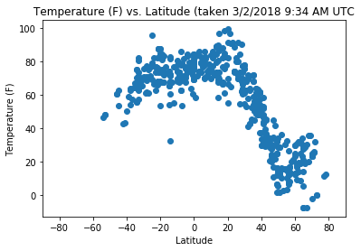

```python
# Dependencies
import requests
import json
import random
import pandas as pd
import numpy as np
import matplotlib.pyplot as plt
from citipy import citipy
from secrets import future
```


```python
# Make a list of 501 cities chosen by random latitude and longitude

# Empty lists to be filled
city_list = []
country_code_list = []
lat_list = []
lon_list = []

# Until citylists is populated by 500 cities, keep doing things
while len(city_list) <= 500:
    lat = random.randint(-180, 181)
    lon = random.randint(-90, 91)
    city = citipy.nearest_city(lat, lon)
    if city.city_name not in city_list:
        city_list.append(city.city_name)
        country_code_list.append(city.country_code)
        lat_list.append(lat)
        lon_list.append(lon)
#print(citylist)
```


```python
# Make it a dataframe
weather_df = pd.DataFrame({"City Name": city_list, 
                        "Country Code": country_code_list, 
                        "Latitude": lat_list, 
                        "Longitude": lon_list,
                        "Temperature": "",
                        "Humidity (%)": "",
                        "Cloudiness (%)": "",
                        "Wind Speed": ""})
weather_df = weather_df[["City Name", "Country Code", "Latitude", "Longitude", "Temperature", "Humidity (%)", "Cloudiness (%)", "Wind Speed"]]
weather_df.head()
weather_df["Country Code"].value_counts()
```


    br    43
    ru    33
    ca    21
    za    16
    us    13
    in    13
    cl    12
    no    11
    mg    11
    gl    11
    kz    11
    it    10
    ar    10
    ly     9
    ir     8
    pt     8
    es     8
    cd     7
    pe     7
    is     7
    ua     6
    ec     6
    mu     6
    af     6
    cn     5
    cv     5
    gb     5
    tm     5
    so     5
    ml     5
          ..
    et     1
    er     1
    ye     1
    ni     1
    pl     1
    bb     1
    bf     1
    mm     1
    ky     1
    ee     1
    pm     1
    gr     1
    gw     1
    gd     1
    pk     1
    om     1
    kg     1
    tn     1
    cu     1
    se     1
    eg     1
    il     1
    iq     1
    py     1
    id     1
    rw     1
    bj     1
    uz     1
    gq     1
    jm     1
    Name: Country Code, Length: 121, dtype: int64


```python
# URL, prepare DataFrame
weather_url = "http://api.openweathermap.org/data/2.5/weather?q="
weather_df["Temperature"] = ""
weather_df["Humidity (%)"] = ""
weather_df["Cloudiness (%)"] = ""
weather_df["Wind Speed"] = ""

# GET THE WEATHER
for index, key in weather_df.iterrows():
    city = f"{key['City Name']},{key['Country Code']}"
    url = f"{weather_url}{city}&units=imperial&apikey={future}"
#     url = url.replace(" ", "+")

    # Take my api key out of the url that will be displayed
    safe_url = url.replace(future, "SECRET")
    
    # Print log
    print(f"Collecting data for city #{index}: {key['City Name']} From URL: {safe_url}")
    json = requests.get(url).json()
    try:
        lat = json["coord"]["lat"]
        lon = json["coord"]["lon"]
        temperature = json["main"]["temp"]
        humidity = json["main"]["humidity"]
        clouds = json["clouds"]["all"]
        wind_speed = json["wind"]["speed"]
    except:
        print(f"Error Gathering Data for {city}")
    weather_df.set_value(index, "Latitude", lat)
    weather_df.set_value(index, "Longitude", lon)
    weather_df.set_value(index, "Temperature", temperature)
    weather_df.set_value(index, "Humidity (%)", humidity)
    weather_df.set_value(index, "Cloudiness (%)", clouds)
    weather_df.set_value(index, "Wind Speed", wind_speed)

print("------------------------")
print("Data collection complete")
```

    Collecting data for city #0: dikson From URL: http://api.openweathermap.org/data/2.5/weather?q=dikson,ru&units=imperial&apikey=SECRET
    Collecting data for city #1: illoqqortoormiut From URL: http://api.openweathermap.org/data/2.5/weather?q=illoqqortoormiut,gl&units=imperial&apikey=SECRET
    Error Gathering Data for illoqqortoormiut,gl
    Collecting data for city #2: tessalit From URL: http://api.openweathermap.org/data/2.5/weather?q=tessalit,ml&units=imperial&apikey=SECRET
    Collecting data for city #3: qaanaaq From URL: http://api.openweathermap.org/data/2.5/weather?q=qaanaaq,gl&units=imperial&apikey=SECRET
    Collecting data for city #4: castelldefels From URL: http://api.openweathermap.org/data/2.5/weather?q=castelldefels,es&units=imperial&apikey=SECRET
    Collecting data for city #5: ushuaia From URL: http://api.openweathermap.org/data/2.5/weather?q=ushuaia,ar&units=imperial&apikey=SECRET
    Collecting data for city #6: upernavik From URL: http://api.openweathermap.org/data/2.5/weather?q=upernavik,gl&units=imperial&apikey=SECRET
    Collecting data for city #7: albany From URL: http://api.openweathermap.org/data/2.5/weather?q=albany,au&units=imperial&apikey=SECRET
    Collecting data for city #8: pokaran From URL: http://api.openweathermap.org/data/2.5/weather?q=pokaran,in&units=imperial&apikey=SECRET
    Collecting data for city #9: bredasdorp From URL: http://api.openweathermap.org/data/2.5/weather?q=bredasdorp,za&units=imperial&apikey=SECRET
    Collecting data for city #10: andarab From URL: http://api.openweathermap.org/data/2.5/weather?q=andarab,af&units=imperial&apikey=SECRET
    Error Gathering Data for andarab,af
    Collecting data for city #11: longyearbyen From URL: http://api.openweathermap.org/data/2.5/weather?q=longyearbyen,sj&units=imperial&apikey=SECRET
    Collecting data for city #12: vila franca do campo From URL: http://api.openweathermap.org/data/2.5/weather?q=vila franca do campo,pt&units=imperial&apikey=SECRET
    Collecting data for city #13: marcona From URL: http://api.openweathermap.org/data/2.5/weather?q=marcona,pe&units=imperial&apikey=SECRET
    Error Gathering Data for marcona,pe
    Collecting data for city #14: jamestown From URL: http://api.openweathermap.org/data/2.5/weather?q=jamestown,sh&units=imperial&apikey=SECRET
    Collecting data for city #15: bahia blanca From URL: http://api.openweathermap.org/data/2.5/weather?q=bahia blanca,ar&units=imperial&apikey=SECRET
    Collecting data for city #16: ribeira grande From URL: http://api.openweathermap.org/data/2.5/weather?q=ribeira grande,pt&units=imperial&apikey=SECRET
    Collecting data for city #17: belushya guba From URL: http://api.openweathermap.org/data/2.5/weather?q=belushya guba,ru&units=imperial&apikey=SECRET
    Error Gathering Data for belushya guba,ru
    Collecting data for city #18: ilheus From URL: http://api.openweathermap.org/data/2.5/weather?q=ilheus,br&units=imperial&apikey=SECRET
    Collecting data for city #19: luba From URL: http://api.openweathermap.org/data/2.5/weather?q=luba,gq&units=imperial&apikey=SECRET
    Collecting data for city #20: comodoro rivadavia From URL: http://api.openweathermap.org/data/2.5/weather?q=comodoro rivadavia,ar&units=imperial&apikey=SECRET
    Collecting data for city #21: cidreira From URL: http://api.openweathermap.org/data/2.5/weather?q=cidreira,br&units=imperial&apikey=SECRET
    Collecting data for city #22: mahebourg From URL: http://api.openweathermap.org/data/2.5/weather?q=mahebourg,mu&units=imperial&apikey=SECRET
    Collecting data for city #23: thinadhoo From URL: http://api.openweathermap.org/data/2.5/weather?q=thinadhoo,mv&units=imperial&apikey=SECRET
    Collecting data for city #24: rubiataba From URL: http://api.openweathermap.org/data/2.5/weather?q=rubiataba,br&units=imperial&apikey=SECRET
    Collecting data for city #25: tumannyy From URL: http://api.openweathermap.org/data/2.5/weather?q=tumannyy,ru&units=imperial&apikey=SECRET
    Error Gathering Data for tumannyy,ru
    Collecting data for city #26: buchanan From URL: http://api.openweathermap.org/data/2.5/weather?q=buchanan,lr&units=imperial&apikey=SECRET
    Collecting data for city #27: san agustin acasaguastlan From URL: http://api.openweathermap.org/data/2.5/weather?q=san agustin acasaguastlan,gt&units=imperial&apikey=SECRET
    Collecting data for city #28: bambous virieux From URL: http://api.openweathermap.org/data/2.5/weather?q=bambous virieux,mu&units=imperial&apikey=SECRET
    Collecting data for city #29: bilma From URL: http://api.openweathermap.org/data/2.5/weather?q=bilma,ne&units=imperial&apikey=SECRET
    Collecting data for city #30: barentsburg From URL: http://api.openweathermap.org/data/2.5/weather?q=barentsburg,sj&units=imperial&apikey=SECRET
    Error Gathering Data for barentsburg,sj
    Collecting data for city #31: port elizabeth From URL: http://api.openweathermap.org/data/2.5/weather?q=port elizabeth,za&units=imperial&apikey=SECRET
    Collecting data for city #32: tsihombe From URL: http://api.openweathermap.org/data/2.5/weather?q=tsihombe,mg&units=imperial&apikey=SECRET
    Error Gathering Data for tsihombe,mg
    Collecting data for city #33: busselton From URL: http://api.openweathermap.org/data/2.5/weather?q=busselton,au&units=imperial&apikey=SECRET
    Collecting data for city #34: port alfred From URL: http://api.openweathermap.org/data/2.5/weather?q=port alfred,za&units=imperial&apikey=SECRET
    Collecting data for city #35: maragogi From URL: http://api.openweathermap.org/data/2.5/weather?q=maragogi,br&units=imperial&apikey=SECRET
    Collecting data for city #36: ilulissat From URL: http://api.openweathermap.org/data/2.5/weather?q=ilulissat,gl&units=imperial&apikey=SECRET
    Collecting data for city #37: klaksvik From URL: http://api.openweathermap.org/data/2.5/weather?q=klaksvik,fo&units=imperial&apikey=SECRET
    Collecting data for city #38: bheramara From URL: http://api.openweathermap.org/data/2.5/weather?q=bheramara,bd&units=imperial&apikey=SECRET
    Collecting data for city #39: tucupita From URL: http://api.openweathermap.org/data/2.5/weather?q=tucupita,ve&units=imperial&apikey=SECRET
    Collecting data for city #40: turukhansk From URL: http://api.openweathermap.org/data/2.5/weather?q=turukhansk,ru&units=imperial&apikey=SECRET
    Collecting data for city #41: killini From URL: http://api.openweathermap.org/data/2.5/weather?q=killini,gr&units=imperial&apikey=SECRET
    Error Gathering Data for killini,gr
    Collecting data for city #42: tucano From URL: http://api.openweathermap.org/data/2.5/weather?q=tucano,br&units=imperial&apikey=SECRET
    Collecting data for city #43: punta arenas From URL: http://api.openweathermap.org/data/2.5/weather?q=punta arenas,cl&units=imperial&apikey=SECRET
    Collecting data for city #44: campohermoso From URL: http://api.openweathermap.org/data/2.5/weather?q=campohermoso,co&units=imperial&apikey=SECRET
    Error Gathering Data for campohermoso,co
    Collecting data for city #45: kruisfontein From URL: http://api.openweathermap.org/data/2.5/weather?q=kruisfontein,za&units=imperial&apikey=SECRET
    Collecting data for city #46: cape town From URL: http://api.openweathermap.org/data/2.5/weather?q=cape town,za&units=imperial&apikey=SECRET
    Collecting data for city #47: minervino murge From URL: http://api.openweathermap.org/data/2.5/weather?q=minervino murge,it&units=imperial&apikey=SECRET
    Collecting data for city #48: lewisporte From URL: http://api.openweathermap.org/data/2.5/weather?q=lewisporte,ca&units=imperial&apikey=SECRET
    Collecting data for city #49: alampur From URL: http://api.openweathermap.org/data/2.5/weather?q=alampur,in&units=imperial&apikey=SECRET
    Collecting data for city #50: espinosa From URL: http://api.openweathermap.org/data/2.5/weather?q=espinosa,br&units=imperial&apikey=SECRET
    Collecting data for city #51: torbay From URL: http://api.openweathermap.org/data/2.5/weather?q=torbay,ca&units=imperial&apikey=SECRET
    Collecting data for city #52: sioux lookout From URL: http://api.openweathermap.org/data/2.5/weather?q=sioux lookout,ca&units=imperial&apikey=SECRET
    Collecting data for city #53: sao joao da barra From URL: http://api.openweathermap.org/data/2.5/weather?q=sao joao da barra,br&units=imperial&apikey=SECRET
    Collecting data for city #54: shurugwi From URL: http://api.openweathermap.org/data/2.5/weather?q=shurugwi,zw&units=imperial&apikey=SECRET
    Collecting data for city #55: grand river south east From URL: http://api.openweathermap.org/data/2.5/weather?q=grand river south east,mu&units=imperial&apikey=SECRET
    Error Gathering Data for grand river south east,mu
    Collecting data for city #56: san miguel From URL: http://api.openweathermap.org/data/2.5/weather?q=san miguel,pa&units=imperial&apikey=SECRET
    Collecting data for city #57: tiruvottiyur From URL: http://api.openweathermap.org/data/2.5/weather?q=tiruvottiyur,in&units=imperial&apikey=SECRET
    Error Gathering Data for tiruvottiyur,in
    Collecting data for city #58: najran From URL: http://api.openweathermap.org/data/2.5/weather?q=najran,sa&units=imperial&apikey=SECRET
    Collecting data for city #59: luderitz From URL: http://api.openweathermap.org/data/2.5/weather?q=luderitz,na&units=imperial&apikey=SECRET
    Collecting data for city #60: burica From URL: http://api.openweathermap.org/data/2.5/weather?q=burica,pa&units=imperial&apikey=SECRET
    Error Gathering Data for burica,pa
    Collecting data for city #61: attawapiskat From URL: http://api.openweathermap.org/data/2.5/weather?q=attawapiskat,ca&units=imperial&apikey=SECRET
    Error Gathering Data for attawapiskat,ca
    Collecting data for city #62: tortoli From URL: http://api.openweathermap.org/data/2.5/weather?q=tortoli,it&units=imperial&apikey=SECRET
    Collecting data for city #63: horki From URL: http://api.openweathermap.org/data/2.5/weather?q=horki,by&units=imperial&apikey=SECRET
    Collecting data for city #64: bolungarvik From URL: http://api.openweathermap.org/data/2.5/weather?q=bolungarvik,is&units=imperial&apikey=SECRET
    Error Gathering Data for bolungarvik,is
    Collecting data for city #65: saint-augustin From URL: http://api.openweathermap.org/data/2.5/weather?q=saint-augustin,ca&units=imperial&apikey=SECRET
    Collecting data for city #66: carbonia From URL: http://api.openweathermap.org/data/2.5/weather?q=carbonia,it&units=imperial&apikey=SECRET
    Collecting data for city #67: trencin From URL: http://api.openweathermap.org/data/2.5/weather?q=trencin,sk&units=imperial&apikey=SECRET
    Collecting data for city #68: richards bay From URL: http://api.openweathermap.org/data/2.5/weather?q=richards bay,za&units=imperial&apikey=SECRET
    Collecting data for city #69: tasiilaq From URL: http://api.openweathermap.org/data/2.5/weather?q=tasiilaq,gl&units=imperial&apikey=SECRET
    Collecting data for city #70: turka From URL: http://api.openweathermap.org/data/2.5/weather?q=turka,ua&units=imperial&apikey=SECRET
    Collecting data for city #71: belmonte From URL: http://api.openweathermap.org/data/2.5/weather?q=belmonte,br&units=imperial&apikey=SECRET
    Collecting data for city #72: saint george From URL: http://api.openweathermap.org/data/2.5/weather?q=saint george,bm&units=imperial&apikey=SECRET
    Collecting data for city #73: taolanaro From URL: http://api.openweathermap.org/data/2.5/weather?q=taolanaro,mg&units=imperial&apikey=SECRET
    Error Gathering Data for taolanaro,mg
    Collecting data for city #74: codrington From URL: http://api.openweathermap.org/data/2.5/weather?q=codrington,ag&units=imperial&apikey=SECRET
    Error Gathering Data for codrington,ag
    Collecting data for city #75: presidencia roque saenz pena From URL: http://api.openweathermap.org/data/2.5/weather?q=presidencia roque saenz pena,ar&units=imperial&apikey=SECRET
    Collecting data for city #76: hithadhoo From URL: http://api.openweathermap.org/data/2.5/weather?q=hithadhoo,mv&units=imperial&apikey=SECRET
    Collecting data for city #77: itarema From URL: http://api.openweathermap.org/data/2.5/weather?q=itarema,br&units=imperial&apikey=SECRET
    Collecting data for city #78: agogo From URL: http://api.openweathermap.org/data/2.5/weather?q=agogo,gh&units=imperial&apikey=SECRET
    Collecting data for city #79: brae From URL: http://api.openweathermap.org/data/2.5/weather?q=brae,gb&units=imperial&apikey=SECRET
    Collecting data for city #80: nioro From URL: http://api.openweathermap.org/data/2.5/weather?q=nioro,ml&units=imperial&apikey=SECRET
    Error Gathering Data for nioro,ml
    Collecting data for city #81: do gonbadan From URL: http://api.openweathermap.org/data/2.5/weather?q=do gonbadan,ir&units=imperial&apikey=SECRET
    Collecting data for city #82: clyde river From URL: http://api.openweathermap.org/data/2.5/weather?q=clyde river,ca&units=imperial&apikey=SECRET
    Collecting data for city #83: terrak From URL: http://api.openweathermap.org/data/2.5/weather?q=terrak,no&units=imperial&apikey=SECRET
    Collecting data for city #84: ostrovnoy From URL: http://api.openweathermap.org/data/2.5/weather?q=ostrovnoy,ru&units=imperial&apikey=SECRET
    Collecting data for city #85: zyryanovsk From URL: http://api.openweathermap.org/data/2.5/weather?q=zyryanovsk,kz&units=imperial&apikey=SECRET
    Collecting data for city #86: amderma From URL: http://api.openweathermap.org/data/2.5/weather?q=amderma,ru&units=imperial&apikey=SECRET
    Error Gathering Data for amderma,ru
    Collecting data for city #87: mocambique From URL: http://api.openweathermap.org/data/2.5/weather?q=mocambique,mz&units=imperial&apikey=SECRET
    Error Gathering Data for mocambique,mz
    Collecting data for city #88: arraial do cabo From URL: http://api.openweathermap.org/data/2.5/weather?q=arraial do cabo,br&units=imperial&apikey=SECRET
    Collecting data for city #89: georgetown From URL: http://api.openweathermap.org/data/2.5/weather?q=georgetown,sh&units=imperial&apikey=SECRET
    Collecting data for city #90: noblesville From URL: http://api.openweathermap.org/data/2.5/weather?q=noblesville,us&units=imperial&apikey=SECRET
    Collecting data for city #91: paamiut From URL: http://api.openweathermap.org/data/2.5/weather?q=paamiut,gl&units=imperial&apikey=SECRET
    Collecting data for city #92: rudbar From URL: http://api.openweathermap.org/data/2.5/weather?q=rudbar,af&units=imperial&apikey=SECRET
    Collecting data for city #93: barbar From URL: http://api.openweathermap.org/data/2.5/weather?q=barbar,sd&units=imperial&apikey=SECRET
    Error Gathering Data for barbar,sd
    Collecting data for city #94: stolac From URL: http://api.openweathermap.org/data/2.5/weather?q=stolac,ba&units=imperial&apikey=SECRET
    Collecting data for city #95: sabzevar From URL: http://api.openweathermap.org/data/2.5/weather?q=sabzevar,ir&units=imperial&apikey=SECRET
    Collecting data for city #96: raudeberg From URL: http://api.openweathermap.org/data/2.5/weather?q=raudeberg,no&units=imperial&apikey=SECRET
    Collecting data for city #97: hamilton From URL: http://api.openweathermap.org/data/2.5/weather?q=hamilton,bm&units=imperial&apikey=SECRET
    Collecting data for city #98: hambantota From URL: http://api.openweathermap.org/data/2.5/weather?q=hambantota,lk&units=imperial&apikey=SECRET
    Collecting data for city #99: hermanus From URL: http://api.openweathermap.org/data/2.5/weather?q=hermanus,za&units=imperial&apikey=SECRET
    Collecting data for city #100: curvelo From URL: http://api.openweathermap.org/data/2.5/weather?q=curvelo,br&units=imperial&apikey=SECRET
    Collecting data for city #101: jacmel From URL: http://api.openweathermap.org/data/2.5/weather?q=jacmel,ht&units=imperial&apikey=SECRET
    Collecting data for city #102: cockburn town From URL: http://api.openweathermap.org/data/2.5/weather?q=cockburn town,bs&units=imperial&apikey=SECRET
    Collecting data for city #103: rundu From URL: http://api.openweathermap.org/data/2.5/weather?q=rundu,na&units=imperial&apikey=SECRET
    Collecting data for city #104: saint-philippe From URL: http://api.openweathermap.org/data/2.5/weather?q=saint-philippe,re&units=imperial&apikey=SECRET
    Collecting data for city #105: umzimvubu From URL: http://api.openweathermap.org/data/2.5/weather?q=umzimvubu,za&units=imperial&apikey=SECRET
    Error Gathering Data for umzimvubu,za
    Collecting data for city #106: quelimane From URL: http://api.openweathermap.org/data/2.5/weather?q=quelimane,mz&units=imperial&apikey=SECRET
    Collecting data for city #107: kigali From URL: http://api.openweathermap.org/data/2.5/weather?q=kigali,rw&units=imperial&apikey=SECRET
    Collecting data for city #108: mahasamund From URL: http://api.openweathermap.org/data/2.5/weather?q=mahasamund,in&units=imperial&apikey=SECRET
    Collecting data for city #109: carnarvon From URL: http://api.openweathermap.org/data/2.5/weather?q=carnarvon,au&units=imperial&apikey=SECRET
    Collecting data for city #110: malangali From URL: http://api.openweathermap.org/data/2.5/weather?q=malangali,tz&units=imperial&apikey=SECRET
    Collecting data for city #111: wala From URL: http://api.openweathermap.org/data/2.5/weather?q=wala,pa&units=imperial&apikey=SECRET
    Error Gathering Data for wala,pa
    Collecting data for city #112: lagoa From URL: http://api.openweathermap.org/data/2.5/weather?q=lagoa,pt&units=imperial&apikey=SECRET
    Collecting data for city #113: kavaratti From URL: http://api.openweathermap.org/data/2.5/weather?q=kavaratti,in&units=imperial&apikey=SECRET
    Collecting data for city #114: windsor From URL: http://api.openweathermap.org/data/2.5/weather?q=windsor,ca&units=imperial&apikey=SECRET
    Collecting data for city #115: souillac From URL: http://api.openweathermap.org/data/2.5/weather?q=souillac,mu&units=imperial&apikey=SECRET
    Collecting data for city #116: gryfice From URL: http://api.openweathermap.org/data/2.5/weather?q=gryfice,pl&units=imperial&apikey=SECRET
    Collecting data for city #117: kathmandu From URL: http://api.openweathermap.org/data/2.5/weather?q=kathmandu,np&units=imperial&apikey=SECRET
    Collecting data for city #118: dolores From URL: http://api.openweathermap.org/data/2.5/weather?q=dolores,ar&units=imperial&apikey=SECRET
    Collecting data for city #119: le port From URL: http://api.openweathermap.org/data/2.5/weather?q=le port,re&units=imperial&apikey=SECRET
    Collecting data for city #120: andevoranto From URL: http://api.openweathermap.org/data/2.5/weather?q=andevoranto,mg&units=imperial&apikey=SECRET
    Error Gathering Data for andevoranto,mg
    Collecting data for city #121: margate From URL: http://api.openweathermap.org/data/2.5/weather?q=margate,za&units=imperial&apikey=SECRET
    Collecting data for city #122: mount pleasant From URL: http://api.openweathermap.org/data/2.5/weather?q=mount pleasant,us&units=imperial&apikey=SECRET
    Collecting data for city #123: tripoli From URL: http://api.openweathermap.org/data/2.5/weather?q=tripoli,ly&units=imperial&apikey=SECRET
    Collecting data for city #124: coihaique From URL: http://api.openweathermap.org/data/2.5/weather?q=coihaique,cl&units=imperial&apikey=SECRET
    Collecting data for city #125: castro daire From URL: http://api.openweathermap.org/data/2.5/weather?q=castro daire,pt&units=imperial&apikey=SECRET
    Collecting data for city #126: coroata From URL: http://api.openweathermap.org/data/2.5/weather?q=coroata,br&units=imperial&apikey=SECRET
    Collecting data for city #127: sychevka From URL: http://api.openweathermap.org/data/2.5/weather?q=sychevka,ru&units=imperial&apikey=SECRET
    Collecting data for city #128: namibe From URL: http://api.openweathermap.org/data/2.5/weather?q=namibe,ao&units=imperial&apikey=SECRET
    Collecting data for city #129: ponta do sol From URL: http://api.openweathermap.org/data/2.5/weather?q=ponta do sol,cv&units=imperial&apikey=SECRET
    Collecting data for city #130: chitungwiza From URL: http://api.openweathermap.org/data/2.5/weather?q=chitungwiza,zw&units=imperial&apikey=SECRET
    Collecting data for city #131: olinda From URL: http://api.openweathermap.org/data/2.5/weather?q=olinda,br&units=imperial&apikey=SECRET
    Collecting data for city #132: fort myers beach From URL: http://api.openweathermap.org/data/2.5/weather?q=fort myers beach,us&units=imperial&apikey=SECRET
    Collecting data for city #133: saint anthony From URL: http://api.openweathermap.org/data/2.5/weather?q=saint anthony,ca&units=imperial&apikey=SECRET
    Error Gathering Data for saint anthony,ca
    Collecting data for city #134: blyth From URL: http://api.openweathermap.org/data/2.5/weather?q=blyth,gb&units=imperial&apikey=SECRET
    Collecting data for city #135: treinta y tres From URL: http://api.openweathermap.org/data/2.5/weather?q=treinta y tres,uy&units=imperial&apikey=SECRET
    Collecting data for city #136: kyzyl-suu From URL: http://api.openweathermap.org/data/2.5/weather?q=kyzyl-suu,kg&units=imperial&apikey=SECRET
    Collecting data for city #137: vytegra From URL: http://api.openweathermap.org/data/2.5/weather?q=vytegra,ru&units=imperial&apikey=SECRET
    Collecting data for city #138: ajdabiya From URL: http://api.openweathermap.org/data/2.5/weather?q=ajdabiya,ly&units=imperial&apikey=SECRET
    Collecting data for city #139: akyab From URL: http://api.openweathermap.org/data/2.5/weather?q=akyab,mm&units=imperial&apikey=SECRET
    Error Gathering Data for akyab,mm
    Collecting data for city #140: iqaluit From URL: http://api.openweathermap.org/data/2.5/weather?q=iqaluit,ca&units=imperial&apikey=SECRET
    Collecting data for city #141: banda aceh From URL: http://api.openweathermap.org/data/2.5/weather?q=banda aceh,id&units=imperial&apikey=SECRET
    Collecting data for city #142: sucua From URL: http://api.openweathermap.org/data/2.5/weather?q=sucua,ec&units=imperial&apikey=SECRET
    Collecting data for city #143: narsaq From URL: http://api.openweathermap.org/data/2.5/weather?q=narsaq,gl&units=imperial&apikey=SECRET
    Collecting data for city #144: bartica From URL: http://api.openweathermap.org/data/2.5/weather?q=bartica,gy&units=imperial&apikey=SECRET
    Collecting data for city #145: trairi From URL: http://api.openweathermap.org/data/2.5/weather?q=trairi,br&units=imperial&apikey=SECRET
    Collecting data for city #146: ormara From URL: http://api.openweathermap.org/data/2.5/weather?q=ormara,pk&units=imperial&apikey=SECRET
    Collecting data for city #147: tiznit From URL: http://api.openweathermap.org/data/2.5/weather?q=tiznit,ma&units=imperial&apikey=SECRET
    Collecting data for city #148: cutro From URL: http://api.openweathermap.org/data/2.5/weather?q=cutro,it&units=imperial&apikey=SECRET
    Collecting data for city #149: mlowo From URL: http://api.openweathermap.org/data/2.5/weather?q=mlowo,tz&units=imperial&apikey=SECRET
    Collecting data for city #150: necochea From URL: http://api.openweathermap.org/data/2.5/weather?q=necochea,ar&units=imperial&apikey=SECRET
    Collecting data for city #151: gandajika From URL: http://api.openweathermap.org/data/2.5/weather?q=gandajika,cd&units=imperial&apikey=SECRET
    Collecting data for city #152: nanortalik From URL: http://api.openweathermap.org/data/2.5/weather?q=nanortalik,gl&units=imperial&apikey=SECRET
    Collecting data for city #153: mto wa mbu From URL: http://api.openweathermap.org/data/2.5/weather?q=mto wa mbu,tz&units=imperial&apikey=SECRET
    Collecting data for city #154: vila velha From URL: http://api.openweathermap.org/data/2.5/weather?q=vila velha,br&units=imperial&apikey=SECRET
    Collecting data for city #155: quiruvilca From URL: http://api.openweathermap.org/data/2.5/weather?q=quiruvilca,pe&units=imperial&apikey=SECRET
    Collecting data for city #156: victoria From URL: http://api.openweathermap.org/data/2.5/weather?q=victoria,sc&units=imperial&apikey=SECRET
    Collecting data for city #157: tabuk From URL: http://api.openweathermap.org/data/2.5/weather?q=tabuk,sa&units=imperial&apikey=SECRET
    Collecting data for city #158: rodrigues alves From URL: http://api.openweathermap.org/data/2.5/weather?q=rodrigues alves,br&units=imperial&apikey=SECRET
    Collecting data for city #159: jenison From URL: http://api.openweathermap.org/data/2.5/weather?q=jenison,us&units=imperial&apikey=SECRET
    Collecting data for city #160: touros From URL: http://api.openweathermap.org/data/2.5/weather?q=touros,br&units=imperial&apikey=SECRET
    Collecting data for city #161: vichuga From URL: http://api.openweathermap.org/data/2.5/weather?q=vichuga,ru&units=imperial&apikey=SECRET
    Collecting data for city #162: maceio From URL: http://api.openweathermap.org/data/2.5/weather?q=maceio,br&units=imperial&apikey=SECRET
    Collecting data for city #163: morro da fumaca From URL: http://api.openweathermap.org/data/2.5/weather?q=morro da fumaca,br&units=imperial&apikey=SECRET
    Collecting data for city #164: baherden From URL: http://api.openweathermap.org/data/2.5/weather?q=baherden,tm&units=imperial&apikey=SECRET
    Collecting data for city #165: east london From URL: http://api.openweathermap.org/data/2.5/weather?q=east london,za&units=imperial&apikey=SECRET
    Collecting data for city #166: santa rosa From URL: http://api.openweathermap.org/data/2.5/weather?q=santa rosa,bo&units=imperial&apikey=SECRET
    Collecting data for city #167: hit From URL: http://api.openweathermap.org/data/2.5/weather?q=hit,iq&units=imperial&apikey=SECRET
    Collecting data for city #168: yhu From URL: http://api.openweathermap.org/data/2.5/weather?q=yhu,py&units=imperial&apikey=SECRET
    Collecting data for city #169: beloha From URL: http://api.openweathermap.org/data/2.5/weather?q=beloha,mg&units=imperial&apikey=SECRET
    Collecting data for city #170: alta floresta From URL: http://api.openweathermap.org/data/2.5/weather?q=alta floresta,br&units=imperial&apikey=SECRET
    Collecting data for city #171: manta From URL: http://api.openweathermap.org/data/2.5/weather?q=manta,ec&units=imperial&apikey=SECRET
    Collecting data for city #172: usinsk From URL: http://api.openweathermap.org/data/2.5/weather?q=usinsk,ru&units=imperial&apikey=SECRET
    Collecting data for city #173: nchelenge From URL: http://api.openweathermap.org/data/2.5/weather?q=nchelenge,zm&units=imperial&apikey=SECRET
    Collecting data for city #174: riviere-au-renard From URL: http://api.openweathermap.org/data/2.5/weather?q=riviere-au-renard,ca&units=imperial&apikey=SECRET
    Collecting data for city #175: eskasem From URL: http://api.openweathermap.org/data/2.5/weather?q=eskasem,af&units=imperial&apikey=SECRET
    Error Gathering Data for eskasem,af
    Collecting data for city #176: acarau From URL: http://api.openweathermap.org/data/2.5/weather?q=acarau,br&units=imperial&apikey=SECRET
    Error Gathering Data for acarau,br
    Collecting data for city #177: plettenberg bay From URL: http://api.openweathermap.org/data/2.5/weather?q=plettenberg bay,za&units=imperial&apikey=SECRET
    Collecting data for city #178: jacqueville From URL: http://api.openweathermap.org/data/2.5/weather?q=jacqueville,ci&units=imperial&apikey=SECRET
    Collecting data for city #179: capoterra From URL: http://api.openweathermap.org/data/2.5/weather?q=capoterra,it&units=imperial&apikey=SECRET
    Collecting data for city #180: los llanos de aridane From URL: http://api.openweathermap.org/data/2.5/weather?q=los llanos de aridane,es&units=imperial&apikey=SECRET
    Collecting data for city #181: muros From URL: http://api.openweathermap.org/data/2.5/weather?q=muros,es&units=imperial&apikey=SECRET
    Collecting data for city #182: hammerfest From URL: http://api.openweathermap.org/data/2.5/weather?q=hammerfest,no&units=imperial&apikey=SECRET
    Collecting data for city #183: bur gabo From URL: http://api.openweathermap.org/data/2.5/weather?q=bur gabo,so&units=imperial&apikey=SECRET
    Error Gathering Data for bur gabo,so
    Collecting data for city #184: bayan From URL: http://api.openweathermap.org/data/2.5/weather?q=bayan,kw&units=imperial&apikey=SECRET
    Collecting data for city #185: halifax From URL: http://api.openweathermap.org/data/2.5/weather?q=halifax,ca&units=imperial&apikey=SECRET
    Collecting data for city #186: olafsvik From URL: http://api.openweathermap.org/data/2.5/weather?q=olafsvik,is&units=imperial&apikey=SECRET
    Error Gathering Data for olafsvik,is
    Collecting data for city #187: faya From URL: http://api.openweathermap.org/data/2.5/weather?q=faya,td&units=imperial&apikey=SECRET
    Error Gathering Data for faya,td
    Collecting data for city #188: kutum From URL: http://api.openweathermap.org/data/2.5/weather?q=kutum,sd&units=imperial&apikey=SECRET
    Collecting data for city #189: diveyevo From URL: http://api.openweathermap.org/data/2.5/weather?q=diveyevo,ru&units=imperial&apikey=SECRET
    Collecting data for city #190: uruzgan From URL: http://api.openweathermap.org/data/2.5/weather?q=uruzgan,af&units=imperial&apikey=SECRET
    Collecting data for city #191: mar del plata From URL: http://api.openweathermap.org/data/2.5/weather?q=mar del plata,ar&units=imperial&apikey=SECRET
    Collecting data for city #192: goderich From URL: http://api.openweathermap.org/data/2.5/weather?q=goderich,sl&units=imperial&apikey=SECRET
    Error Gathering Data for goderich,sl
    Collecting data for city #193: lebu From URL: http://api.openweathermap.org/data/2.5/weather?q=lebu,cl&units=imperial&apikey=SECRET
    Collecting data for city #194: vila do maio From URL: http://api.openweathermap.org/data/2.5/weather?q=vila do maio,cv&units=imperial&apikey=SECRET
    Collecting data for city #195: narasannapeta From URL: http://api.openweathermap.org/data/2.5/weather?q=narasannapeta,in&units=imperial&apikey=SECRET
    Collecting data for city #196: chuy From URL: http://api.openweathermap.org/data/2.5/weather?q=chuy,uy&units=imperial&apikey=SECRET
    Collecting data for city #197: ikalamavony From URL: http://api.openweathermap.org/data/2.5/weather?q=ikalamavony,mg&units=imperial&apikey=SECRET
    Collecting data for city #198: araouane From URL: http://api.openweathermap.org/data/2.5/weather?q=araouane,ml&units=imperial&apikey=SECRET
    Collecting data for city #199: visnes From URL: http://api.openweathermap.org/data/2.5/weather?q=visnes,no&units=imperial&apikey=SECRET
    Collecting data for city #200: mathbaria From URL: http://api.openweathermap.org/data/2.5/weather?q=mathbaria,bd&units=imperial&apikey=SECRET
    Collecting data for city #201: bajos de haina From URL: http://api.openweathermap.org/data/2.5/weather?q=bajos de haina,do&units=imperial&apikey=SECRET
    Collecting data for city #202: kalengwa From URL: http://api.openweathermap.org/data/2.5/weather?q=kalengwa,zm&units=imperial&apikey=SECRET
    Collecting data for city #203: mabaruma From URL: http://api.openweathermap.org/data/2.5/weather?q=mabaruma,gy&units=imperial&apikey=SECRET
    Collecting data for city #204: cap malheureux From URL: http://api.openweathermap.org/data/2.5/weather?q=cap malheureux,mu&units=imperial&apikey=SECRET
    Collecting data for city #205: mozarlandia From URL: http://api.openweathermap.org/data/2.5/weather?q=mozarlandia,br&units=imperial&apikey=SECRET
    Collecting data for city #206: ancud From URL: http://api.openweathermap.org/data/2.5/weather?q=ancud,cl&units=imperial&apikey=SECRET
    Collecting data for city #207: igarka From URL: http://api.openweathermap.org/data/2.5/weather?q=igarka,ru&units=imperial&apikey=SECRET
    Collecting data for city #208: evreux From URL: http://api.openweathermap.org/data/2.5/weather?q=evreux,fr&units=imperial&apikey=SECRET
    Collecting data for city #209: adrar From URL: http://api.openweathermap.org/data/2.5/weather?q=adrar,dz&units=imperial&apikey=SECRET
    Collecting data for city #210: tostamaa From URL: http://api.openweathermap.org/data/2.5/weather?q=tostamaa,ee&units=imperial&apikey=SECRET
    Error Gathering Data for tostamaa,ee
    Collecting data for city #211: saldanha From URL: http://api.openweathermap.org/data/2.5/weather?q=saldanha,za&units=imperial&apikey=SECRET
    Collecting data for city #212: port blair From URL: http://api.openweathermap.org/data/2.5/weather?q=port blair,in&units=imperial&apikey=SECRET
    Collecting data for city #213: mehamn From URL: http://api.openweathermap.org/data/2.5/weather?q=mehamn,no&units=imperial&apikey=SECRET
    Collecting data for city #214: beauceville From URL: http://api.openweathermap.org/data/2.5/weather?q=beauceville,ca&units=imperial&apikey=SECRET
    Collecting data for city #215: valparaiso From URL: http://api.openweathermap.org/data/2.5/weather?q=valparaiso,cl&units=imperial&apikey=SECRET
    Collecting data for city #216: husavik From URL: http://api.openweathermap.org/data/2.5/weather?q=husavik,is&units=imperial&apikey=SECRET
    Collecting data for city #217: sovetskiy From URL: http://api.openweathermap.org/data/2.5/weather?q=sovetskiy,ru&units=imperial&apikey=SECRET
    Collecting data for city #218: sertanopolis From URL: http://api.openweathermap.org/data/2.5/weather?q=sertanopolis,br&units=imperial&apikey=SECRET
    Collecting data for city #219: cayenne From URL: http://api.openweathermap.org/data/2.5/weather?q=cayenne,gf&units=imperial&apikey=SECRET
    Collecting data for city #220: laurel From URL: http://api.openweathermap.org/data/2.5/weather?q=laurel,us&units=imperial&apikey=SECRET
    Collecting data for city #221: cuenca From URL: http://api.openweathermap.org/data/2.5/weather?q=cuenca,es&units=imperial&apikey=SECRET
    Collecting data for city #222: melilla From URL: http://api.openweathermap.org/data/2.5/weather?q=melilla,es&units=imperial&apikey=SECRET
    Collecting data for city #223: khunti From URL: http://api.openweathermap.org/data/2.5/weather?q=khunti,in&units=imperial&apikey=SECRET
    Collecting data for city #224: takoradi From URL: http://api.openweathermap.org/data/2.5/weather?q=takoradi,gh&units=imperial&apikey=SECRET
    Collecting data for city #225: kanungu From URL: http://api.openweathermap.org/data/2.5/weather?q=kanungu,ug&units=imperial&apikey=SECRET
    Collecting data for city #226: azad shahr From URL: http://api.openweathermap.org/data/2.5/weather?q=azad shahr,ir&units=imperial&apikey=SECRET
    Error Gathering Data for azad shahr,ir
    Collecting data for city #227: bereda From URL: http://api.openweathermap.org/data/2.5/weather?q=bereda,so&units=imperial&apikey=SECRET
    Error Gathering Data for bereda,so
    Collecting data for city #228: iquique From URL: http://api.openweathermap.org/data/2.5/weather?q=iquique,cl&units=imperial&apikey=SECRET
    Collecting data for city #229: nizhnyaya tavda From URL: http://api.openweathermap.org/data/2.5/weather?q=nizhnyaya tavda,ru&units=imperial&apikey=SECRET
    Collecting data for city #230: mrirt From URL: http://api.openweathermap.org/data/2.5/weather?q=mrirt,ma&units=imperial&apikey=SECRET
    Error Gathering Data for mrirt,ma
    Collecting data for city #231: zlobin From URL: http://api.openweathermap.org/data/2.5/weather?q=zlobin,by&units=imperial&apikey=SECRET
    Error Gathering Data for zlobin,by
    Collecting data for city #232: anjozorobe From URL: http://api.openweathermap.org/data/2.5/weather?q=anjozorobe,mg&units=imperial&apikey=SECRET
    Collecting data for city #233: rio grande From URL: http://api.openweathermap.org/data/2.5/weather?q=rio grande,br&units=imperial&apikey=SECRET
    Collecting data for city #234: port-gentil From URL: http://api.openweathermap.org/data/2.5/weather?q=port-gentil,ga&units=imperial&apikey=SECRET
    Collecting data for city #235: sinnamary From URL: http://api.openweathermap.org/data/2.5/weather?q=sinnamary,gf&units=imperial&apikey=SECRET
    Collecting data for city #236: kristianstad From URL: http://api.openweathermap.org/data/2.5/weather?q=kristianstad,se&units=imperial&apikey=SECRET
    Collecting data for city #237: porto novo From URL: http://api.openweathermap.org/data/2.5/weather?q=porto novo,cv&units=imperial&apikey=SECRET
    Collecting data for city #238: bubaque From URL: http://api.openweathermap.org/data/2.5/weather?q=bubaque,gw&units=imperial&apikey=SECRET
    Collecting data for city #239: upata From URL: http://api.openweathermap.org/data/2.5/weather?q=upata,ve&units=imperial&apikey=SECRET
    Collecting data for city #240: rypefjord From URL: http://api.openweathermap.org/data/2.5/weather?q=rypefjord,no&units=imperial&apikey=SECRET
    Collecting data for city #241: diu From URL: http://api.openweathermap.org/data/2.5/weather?q=diu,in&units=imperial&apikey=SECRET
    Collecting data for city #242: hearst From URL: http://api.openweathermap.org/data/2.5/weather?q=hearst,ca&units=imperial&apikey=SECRET
    Collecting data for city #243: dori From URL: http://api.openweathermap.org/data/2.5/weather?q=dori,bf&units=imperial&apikey=SECRET
    Collecting data for city #244: progreso From URL: http://api.openweathermap.org/data/2.5/weather?q=progreso,mx&units=imperial&apikey=SECRET
    Collecting data for city #245: meleuz From URL: http://api.openweathermap.org/data/2.5/weather?q=meleuz,ru&units=imperial&apikey=SECRET
    Collecting data for city #246: pokhara From URL: http://api.openweathermap.org/data/2.5/weather?q=pokhara,np&units=imperial&apikey=SECRET
    Collecting data for city #247: samana From URL: http://api.openweathermap.org/data/2.5/weather?q=samana,do&units=imperial&apikey=SECRET
    Error Gathering Data for samana,do
    Collecting data for city #248: awbari From URL: http://api.openweathermap.org/data/2.5/weather?q=awbari,ly&units=imperial&apikey=SECRET
    Collecting data for city #249: bahia de caraquez From URL: http://api.openweathermap.org/data/2.5/weather?q=bahia de caraquez,ec&units=imperial&apikey=SECRET
    Collecting data for city #250: ballina From URL: http://api.openweathermap.org/data/2.5/weather?q=ballina,ie&units=imperial&apikey=SECRET
    Collecting data for city #251: sorland From URL: http://api.openweathermap.org/data/2.5/weather?q=sorland,no&units=imperial&apikey=SECRET
    Collecting data for city #252: basoko From URL: http://api.openweathermap.org/data/2.5/weather?q=basoko,cd&units=imperial&apikey=SECRET
    Collecting data for city #253: zhitikara From URL: http://api.openweathermap.org/data/2.5/weather?q=zhitikara,kz&units=imperial&apikey=SECRET
    Error Gathering Data for zhitikara,kz
    Collecting data for city #254: agirish From URL: http://api.openweathermap.org/data/2.5/weather?q=agirish,ru&units=imperial&apikey=SECRET
    Collecting data for city #255: urumqi From URL: http://api.openweathermap.org/data/2.5/weather?q=urumqi,cn&units=imperial&apikey=SECRET
    Error Gathering Data for urumqi,cn
    Collecting data for city #256: salalah From URL: http://api.openweathermap.org/data/2.5/weather?q=salalah,om&units=imperial&apikey=SECRET
    Collecting data for city #257: aksu From URL: http://api.openweathermap.org/data/2.5/weather?q=aksu,cn&units=imperial&apikey=SECRET
    Collecting data for city #258: sept-iles From URL: http://api.openweathermap.org/data/2.5/weather?q=sept-iles,ca&units=imperial&apikey=SECRET
    Collecting data for city #259: nuuk From URL: http://api.openweathermap.org/data/2.5/weather?q=nuuk,gl&units=imperial&apikey=SECRET
    Collecting data for city #260: george From URL: http://api.openweathermap.org/data/2.5/weather?q=george,za&units=imperial&apikey=SECRET
    Collecting data for city #261: casablanca From URL: http://api.openweathermap.org/data/2.5/weather?q=casablanca,ma&units=imperial&apikey=SECRET
    Collecting data for city #262: gouyave From URL: http://api.openweathermap.org/data/2.5/weather?q=gouyave,gd&units=imperial&apikey=SECRET
    Collecting data for city #263: hofn From URL: http://api.openweathermap.org/data/2.5/weather?q=hofn,is&units=imperial&apikey=SECRET
    Collecting data for city #264: leca da palmeira From URL: http://api.openweathermap.org/data/2.5/weather?q=leca da palmeira,pt&units=imperial&apikey=SECRET
    Collecting data for city #265: grand gaube From URL: http://api.openweathermap.org/data/2.5/weather?q=grand gaube,mu&units=imperial&apikey=SECRET
    Collecting data for city #266: baneh From URL: http://api.openweathermap.org/data/2.5/weather?q=baneh,ir&units=imperial&apikey=SECRET
    Collecting data for city #267: salinopolis From URL: http://api.openweathermap.org/data/2.5/weather?q=salinopolis,br&units=imperial&apikey=SECRET
    Collecting data for city #268: laguna From URL: http://api.openweathermap.org/data/2.5/weather?q=laguna,br&units=imperial&apikey=SECRET
    Error Gathering Data for laguna,br
    Collecting data for city #269: bocaranga From URL: http://api.openweathermap.org/data/2.5/weather?q=bocaranga,cf&units=imperial&apikey=SECRET
    Error Gathering Data for bocaranga,cf
    Collecting data for city #270: waddan From URL: http://api.openweathermap.org/data/2.5/weather?q=waddan,ly&units=imperial&apikey=SECRET
    Collecting data for city #271: castro From URL: http://api.openweathermap.org/data/2.5/weather?q=castro,cl&units=imperial&apikey=SECRET
    Collecting data for city #272: carros From URL: http://api.openweathermap.org/data/2.5/weather?q=carros,fr&units=imperial&apikey=SECRET
    Collecting data for city #273: damghan From URL: http://api.openweathermap.org/data/2.5/weather?q=damghan,ir&units=imperial&apikey=SECRET
    Collecting data for city #274: ayagoz From URL: http://api.openweathermap.org/data/2.5/weather?q=ayagoz,kz&units=imperial&apikey=SECRET
    Collecting data for city #275: mgandu From URL: http://api.openweathermap.org/data/2.5/weather?q=mgandu,tz&units=imperial&apikey=SECRET
    Collecting data for city #276: azangaro From URL: http://api.openweathermap.org/data/2.5/weather?q=azangaro,pe&units=imperial&apikey=SECRET
    Collecting data for city #277: moussoro From URL: http://api.openweathermap.org/data/2.5/weather?q=moussoro,td&units=imperial&apikey=SECRET
    Collecting data for city #278: bonavista From URL: http://api.openweathermap.org/data/2.5/weather?q=bonavista,ca&units=imperial&apikey=SECRET
    Collecting data for city #279: karkaralinsk From URL: http://api.openweathermap.org/data/2.5/weather?q=karkaralinsk,kz&units=imperial&apikey=SECRET
    Error Gathering Data for karkaralinsk,kz
    Collecting data for city #280: copiapo From URL: http://api.openweathermap.org/data/2.5/weather?q=copiapo,cl&units=imperial&apikey=SECRET
    Collecting data for city #281: vychegodskiy From URL: http://api.openweathermap.org/data/2.5/weather?q=vychegodskiy,ru&units=imperial&apikey=SECRET
    Collecting data for city #282: santa cruz From URL: http://api.openweathermap.org/data/2.5/weather?q=santa cruz,cr&units=imperial&apikey=SECRET
    Collecting data for city #283: goldsboro From URL: http://api.openweathermap.org/data/2.5/weather?q=goldsboro,us&units=imperial&apikey=SECRET
    Collecting data for city #284: henties bay From URL: http://api.openweathermap.org/data/2.5/weather?q=henties bay,na&units=imperial&apikey=SECRET
    Collecting data for city #285: umm kaddadah From URL: http://api.openweathermap.org/data/2.5/weather?q=umm kaddadah,sd&units=imperial&apikey=SECRET
    Collecting data for city #286: vera cruz From URL: http://api.openweathermap.org/data/2.5/weather?q=vera cruz,br&units=imperial&apikey=SECRET
    Collecting data for city #287: dingle From URL: http://api.openweathermap.org/data/2.5/weather?q=dingle,ie&units=imperial&apikey=SECRET
    Collecting data for city #288: carahue From URL: http://api.openweathermap.org/data/2.5/weather?q=carahue,cl&units=imperial&apikey=SECRET
    Collecting data for city #289: moroto From URL: http://api.openweathermap.org/data/2.5/weather?q=moroto,ug&units=imperial&apikey=SECRET
    Collecting data for city #290: bosaso From URL: http://api.openweathermap.org/data/2.5/weather?q=bosaso,so&units=imperial&apikey=SECRET
    Collecting data for city #291: mazyr From URL: http://api.openweathermap.org/data/2.5/weather?q=mazyr,by&units=imperial&apikey=SECRET
    Collecting data for city #292: sechura From URL: http://api.openweathermap.org/data/2.5/weather?q=sechura,pe&units=imperial&apikey=SECRET
    Collecting data for city #293: maniitsoq From URL: http://api.openweathermap.org/data/2.5/weather?q=maniitsoq,gl&units=imperial&apikey=SECRET
    Collecting data for city #294: kita From URL: http://api.openweathermap.org/data/2.5/weather?q=kita,ml&units=imperial&apikey=SECRET
    Collecting data for city #295: umm lajj From URL: http://api.openweathermap.org/data/2.5/weather?q=umm lajj,sa&units=imperial&apikey=SECRET
    Collecting data for city #296: boundiali From URL: http://api.openweathermap.org/data/2.5/weather?q=boundiali,ci&units=imperial&apikey=SECRET
    Collecting data for city #297: villazon From URL: http://api.openweathermap.org/data/2.5/weather?q=villazon,bo&units=imperial&apikey=SECRET
    Error Gathering Data for villazon,bo
    Collecting data for city #298: ergani From URL: http://api.openweathermap.org/data/2.5/weather?q=ergani,tr&units=imperial&apikey=SECRET
    Collecting data for city #299: salym From URL: http://api.openweathermap.org/data/2.5/weather?q=salym,ru&units=imperial&apikey=SECRET
    Collecting data for city #300: dumbraveni From URL: http://api.openweathermap.org/data/2.5/weather?q=dumbraveni,ro&units=imperial&apikey=SECRET
    Collecting data for city #301: boffa From URL: http://api.openweathermap.org/data/2.5/weather?q=boffa,gn&units=imperial&apikey=SECRET
    Collecting data for city #302: qandala From URL: http://api.openweathermap.org/data/2.5/weather?q=qandala,so&units=imperial&apikey=SECRET
    Collecting data for city #303: loviisa From URL: http://api.openweathermap.org/data/2.5/weather?q=loviisa,fi&units=imperial&apikey=SECRET
    Collecting data for city #304: borgarnes From URL: http://api.openweathermap.org/data/2.5/weather?q=borgarnes,is&units=imperial&apikey=SECRET
    Collecting data for city #305: teguise From URL: http://api.openweathermap.org/data/2.5/weather?q=teguise,es&units=imperial&apikey=SECRET
    Collecting data for city #306: tukrah From URL: http://api.openweathermap.org/data/2.5/weather?q=tukrah,ly&units=imperial&apikey=SECRET
    Error Gathering Data for tukrah,ly
    Collecting data for city #307: morant bay From URL: http://api.openweathermap.org/data/2.5/weather?q=morant bay,jm&units=imperial&apikey=SECRET
    Collecting data for city #308: voi From URL: http://api.openweathermap.org/data/2.5/weather?q=voi,ke&units=imperial&apikey=SECRET
    Collecting data for city #309: qasigiannguit From URL: http://api.openweathermap.org/data/2.5/weather?q=qasigiannguit,gl&units=imperial&apikey=SECRET
    Collecting data for city #310: sao filipe From URL: http://api.openweathermap.org/data/2.5/weather?q=sao filipe,cv&units=imperial&apikey=SECRET
    Collecting data for city #311: terrasini From URL: http://api.openweathermap.org/data/2.5/weather?q=terrasini,it&units=imperial&apikey=SECRET
    Collecting data for city #312: san buenaventura From URL: http://api.openweathermap.org/data/2.5/weather?q=san buenaventura,hn&units=imperial&apikey=SECRET
    Collecting data for city #313: valkeala From URL: http://api.openweathermap.org/data/2.5/weather?q=valkeala,fi&units=imperial&apikey=SECRET
    Collecting data for city #314: vestmannaeyjar From URL: http://api.openweathermap.org/data/2.5/weather?q=vestmannaeyjar,is&units=imperial&apikey=SECRET
    Collecting data for city #315: zabid From URL: http://api.openweathermap.org/data/2.5/weather?q=zabid,ye&units=imperial&apikey=SECRET
    Collecting data for city #316: santa marta From URL: http://api.openweathermap.org/data/2.5/weather?q=santa marta,co&units=imperial&apikey=SECRET
    Collecting data for city #317: beira From URL: http://api.openweathermap.org/data/2.5/weather?q=beira,mz&units=imperial&apikey=SECRET
    Collecting data for city #318: oranjemund From URL: http://api.openweathermap.org/data/2.5/weather?q=oranjemund,na&units=imperial&apikey=SECRET
    Collecting data for city #319: muli From URL: http://api.openweathermap.org/data/2.5/weather?q=muli,mv&units=imperial&apikey=SECRET
    Collecting data for city #320: diamantino From URL: http://api.openweathermap.org/data/2.5/weather?q=diamantino,br&units=imperial&apikey=SECRET
    Collecting data for city #321: bakhmach From URL: http://api.openweathermap.org/data/2.5/weather?q=bakhmach,ua&units=imperial&apikey=SECRET
    Collecting data for city #322: streator From URL: http://api.openweathermap.org/data/2.5/weather?q=streator,us&units=imperial&apikey=SECRET
    Collecting data for city #323: mananara From URL: http://api.openweathermap.org/data/2.5/weather?q=mananara,mg&units=imperial&apikey=SECRET
    Error Gathering Data for mananara,mg
    Collecting data for city #324: ust-tsilma From URL: http://api.openweathermap.org/data/2.5/weather?q=ust-tsilma,ru&units=imperial&apikey=SECRET
    Collecting data for city #325: kashi From URL: http://api.openweathermap.org/data/2.5/weather?q=kashi,cn&units=imperial&apikey=SECRET
    Collecting data for city #326: allonnes From URL: http://api.openweathermap.org/data/2.5/weather?q=allonnes,fr&units=imperial&apikey=SECRET
    Collecting data for city #327: saint-pierre From URL: http://api.openweathermap.org/data/2.5/weather?q=saint-pierre,pm&units=imperial&apikey=SECRET
    Collecting data for city #328: batticaloa From URL: http://api.openweathermap.org/data/2.5/weather?q=batticaloa,lk&units=imperial&apikey=SECRET
    Collecting data for city #329: matinha From URL: http://api.openweathermap.org/data/2.5/weather?q=matinha,br&units=imperial&apikey=SECRET
    Collecting data for city #330: astana From URL: http://api.openweathermap.org/data/2.5/weather?q=astana,kz&units=imperial&apikey=SECRET
    Collecting data for city #331: voyinka From URL: http://api.openweathermap.org/data/2.5/weather?q=voyinka,ua&units=imperial&apikey=SECRET
    Collecting data for city #332: shache From URL: http://api.openweathermap.org/data/2.5/weather?q=shache,cn&units=imperial&apikey=SECRET
    Collecting data for city #333: abay From URL: http://api.openweathermap.org/data/2.5/weather?q=abay,kz&units=imperial&apikey=SECRET
    Collecting data for city #334: lesogorsk From URL: http://api.openweathermap.org/data/2.5/weather?q=lesogorsk,ru&units=imperial&apikey=SECRET
    Collecting data for city #335: jamsa From URL: http://api.openweathermap.org/data/2.5/weather?q=jamsa,fi&units=imperial&apikey=SECRET
    Collecting data for city #336: likasi From URL: http://api.openweathermap.org/data/2.5/weather?q=likasi,cd&units=imperial&apikey=SECRET
    Collecting data for city #337: beyneu From URL: http://api.openweathermap.org/data/2.5/weather?q=beyneu,kz&units=imperial&apikey=SECRET
    Collecting data for city #338: ceres From URL: http://api.openweathermap.org/data/2.5/weather?q=ceres,za&units=imperial&apikey=SECRET
    Collecting data for city #339: acari From URL: http://api.openweathermap.org/data/2.5/weather?q=acari,pe&units=imperial&apikey=SECRET
    Collecting data for city #340: nouadhibou From URL: http://api.openweathermap.org/data/2.5/weather?q=nouadhibou,mr&units=imperial&apikey=SECRET
    Collecting data for city #341: terny From URL: http://api.openweathermap.org/data/2.5/weather?q=terny,ua&units=imperial&apikey=SECRET
    Collecting data for city #342: bodden town From URL: http://api.openweathermap.org/data/2.5/weather?q=bodden town,ky&units=imperial&apikey=SECRET
    Collecting data for city #343: mumbwa From URL: http://api.openweathermap.org/data/2.5/weather?q=mumbwa,zm&units=imperial&apikey=SECRET
    Collecting data for city #344: mbekenyera From URL: http://api.openweathermap.org/data/2.5/weather?q=mbekenyera,tz&units=imperial&apikey=SECRET
    Collecting data for city #345: taybad From URL: http://api.openweathermap.org/data/2.5/weather?q=taybad,ir&units=imperial&apikey=SECRET
    Collecting data for city #346: florianopolis From URL: http://api.openweathermap.org/data/2.5/weather?q=florianopolis,br&units=imperial&apikey=SECRET
    Collecting data for city #347: edd From URL: http://api.openweathermap.org/data/2.5/weather?q=edd,er&units=imperial&apikey=SECRET
    Collecting data for city #348: bathsheba From URL: http://api.openweathermap.org/data/2.5/weather?q=bathsheba,bb&units=imperial&apikey=SECRET
    Collecting data for city #349: povenets From URL: http://api.openweathermap.org/data/2.5/weather?q=povenets,ru&units=imperial&apikey=SECRET
    Collecting data for city #350: nizhnyaya salda From URL: http://api.openweathermap.org/data/2.5/weather?q=nizhnyaya salda,ru&units=imperial&apikey=SECRET
    Collecting data for city #351: inirida From URL: http://api.openweathermap.org/data/2.5/weather?q=inirida,co&units=imperial&apikey=SECRET
    Collecting data for city #352: carinhanha From URL: http://api.openweathermap.org/data/2.5/weather?q=carinhanha,br&units=imperial&apikey=SECRET
    Collecting data for city #353: camacha From URL: http://api.openweathermap.org/data/2.5/weather?q=camacha,pt&units=imperial&apikey=SECRET
    Collecting data for city #354: paita From URL: http://api.openweathermap.org/data/2.5/weather?q=paita,pe&units=imperial&apikey=SECRET
    Collecting data for city #355: kamyshin From URL: http://api.openweathermap.org/data/2.5/weather?q=kamyshin,ru&units=imperial&apikey=SECRET
    Collecting data for city #356: korla From URL: http://api.openweathermap.org/data/2.5/weather?q=korla,cn&units=imperial&apikey=SECRET
    Collecting data for city #357: boende From URL: http://api.openweathermap.org/data/2.5/weather?q=boende,cd&units=imperial&apikey=SECRET
    Collecting data for city #358: kalmunai From URL: http://api.openweathermap.org/data/2.5/weather?q=kalmunai,lk&units=imperial&apikey=SECRET
    Collecting data for city #359: cefalu From URL: http://api.openweathermap.org/data/2.5/weather?q=cefalu,it&units=imperial&apikey=SECRET
    Collecting data for city #360: bage From URL: http://api.openweathermap.org/data/2.5/weather?q=bage,br&units=imperial&apikey=SECRET
    Collecting data for city #361: dabola From URL: http://api.openweathermap.org/data/2.5/weather?q=dabola,gn&units=imperial&apikey=SECRET
    Collecting data for city #362: tasbuget From URL: http://api.openweathermap.org/data/2.5/weather?q=tasbuget,kz&units=imperial&apikey=SECRET
    Error Gathering Data for tasbuget,kz
    Collecting data for city #363: bonfim From URL: http://api.openweathermap.org/data/2.5/weather?q=bonfim,br&units=imperial&apikey=SECRET
    Collecting data for city #364: bodmin From URL: http://api.openweathermap.org/data/2.5/weather?q=bodmin,gb&units=imperial&apikey=SECRET
    Collecting data for city #365: buraydah From URL: http://api.openweathermap.org/data/2.5/weather?q=buraydah,sa&units=imperial&apikey=SECRET
    Collecting data for city #366: alekseyevka From URL: http://api.openweathermap.org/data/2.5/weather?q=alekseyevka,kz&units=imperial&apikey=SECRET
    Error Gathering Data for alekseyevka,kz
    Collecting data for city #367: madinat sittah uktubar From URL: http://api.openweathermap.org/data/2.5/weather?q=madinat sittah uktubar,eg&units=imperial&apikey=SECRET
    Collecting data for city #368: kosonsoy From URL: http://api.openweathermap.org/data/2.5/weather?q=kosonsoy,uz&units=imperial&apikey=SECRET
    Collecting data for city #369: jabinyanah From URL: http://api.openweathermap.org/data/2.5/weather?q=jabinyanah,tn&units=imperial&apikey=SECRET
    Collecting data for city #370: tingrela From URL: http://api.openweathermap.org/data/2.5/weather?q=tingrela,ci&units=imperial&apikey=SECRET
    Error Gathering Data for tingrela,ci
    Collecting data for city #371: alcaniz From URL: http://api.openweathermap.org/data/2.5/weather?q=alcaniz,es&units=imperial&apikey=SECRET
    Collecting data for city #372: sambava From URL: http://api.openweathermap.org/data/2.5/weather?q=sambava,mg&units=imperial&apikey=SECRET
    Collecting data for city #373: urucui From URL: http://api.openweathermap.org/data/2.5/weather?q=urucui,br&units=imperial&apikey=SECRET
    Collecting data for city #374: gazanjyk From URL: http://api.openweathermap.org/data/2.5/weather?q=gazanjyk,tm&units=imperial&apikey=SECRET
    Collecting data for city #375: opuwo From URL: http://api.openweathermap.org/data/2.5/weather?q=opuwo,na&units=imperial&apikey=SECRET
    Collecting data for city #376: nantucket From URL: http://api.openweathermap.org/data/2.5/weather?q=nantucket,us&units=imperial&apikey=SECRET
    Collecting data for city #377: salvador From URL: http://api.openweathermap.org/data/2.5/weather?q=salvador,br&units=imperial&apikey=SECRET
    Collecting data for city #378: cienfuegos From URL: http://api.openweathermap.org/data/2.5/weather?q=cienfuegos,cu&units=imperial&apikey=SECRET
    Collecting data for city #379: taunton From URL: http://api.openweathermap.org/data/2.5/weather?q=taunton,gb&units=imperial&apikey=SECRET
    Collecting data for city #380: plerin From URL: http://api.openweathermap.org/data/2.5/weather?q=plerin,fr&units=imperial&apikey=SECRET
    Collecting data for city #381: grindavik From URL: http://api.openweathermap.org/data/2.5/weather?q=grindavik,is&units=imperial&apikey=SECRET
    Collecting data for city #382: taywarah From URL: http://api.openweathermap.org/data/2.5/weather?q=taywarah,af&units=imperial&apikey=SECRET
    Collecting data for city #383: aflu From URL: http://api.openweathermap.org/data/2.5/weather?q=aflu,dz&units=imperial&apikey=SECRET
    Error Gathering Data for aflu,dz
    Collecting data for city #384: rebrikha From URL: http://api.openweathermap.org/data/2.5/weather?q=rebrikha,ru&units=imperial&apikey=SECRET
    Collecting data for city #385: andros town From URL: http://api.openweathermap.org/data/2.5/weather?q=andros town,bs&units=imperial&apikey=SECRET
    Collecting data for city #386: bulungu From URL: http://api.openweathermap.org/data/2.5/weather?q=bulungu,cd&units=imperial&apikey=SECRET
    Collecting data for city #387: ardistan From URL: http://api.openweathermap.org/data/2.5/weather?q=ardistan,ir&units=imperial&apikey=SECRET
    Error Gathering Data for ardistan,ir
    Collecting data for city #388: roald From URL: http://api.openweathermap.org/data/2.5/weather?q=roald,no&units=imperial&apikey=SECRET
    Collecting data for city #389: krasnyy bogatyr From URL: http://api.openweathermap.org/data/2.5/weather?q=krasnyy bogatyr,ru&units=imperial&apikey=SECRET
    Collecting data for city #390: louisbourg From URL: http://api.openweathermap.org/data/2.5/weather?q=louisbourg,ca&units=imperial&apikey=SECRET
    Error Gathering Data for louisbourg,ca
    Collecting data for city #391: itaituba From URL: http://api.openweathermap.org/data/2.5/weather?q=itaituba,br&units=imperial&apikey=SECRET
    Collecting data for city #392: san francisco From URL: http://api.openweathermap.org/data/2.5/weather?q=san francisco,ar&units=imperial&apikey=SECRET
    Collecting data for city #393: uwayl From URL: http://api.openweathermap.org/data/2.5/weather?q=uwayl,sd&units=imperial&apikey=SECRET
    Error Gathering Data for uwayl,sd
    Collecting data for city #394: veraval From URL: http://api.openweathermap.org/data/2.5/weather?q=veraval,in&units=imperial&apikey=SECRET
    Collecting data for city #395: kisangani From URL: http://api.openweathermap.org/data/2.5/weather?q=kisangani,cd&units=imperial&apikey=SECRET
    Collecting data for city #396: anori From URL: http://api.openweathermap.org/data/2.5/weather?q=anori,br&units=imperial&apikey=SECRET
    Collecting data for city #397: ortigueira From URL: http://api.openweathermap.org/data/2.5/weather?q=ortigueira,br&units=imperial&apikey=SECRET
    Collecting data for city #398: ashqelon From URL: http://api.openweathermap.org/data/2.5/weather?q=ashqelon,il&units=imperial&apikey=SECRET
    Collecting data for city #399: jalu From URL: http://api.openweathermap.org/data/2.5/weather?q=jalu,ly&units=imperial&apikey=SECRET
    Collecting data for city #400: cotonou From URL: http://api.openweathermap.org/data/2.5/weather?q=cotonou,bj&units=imperial&apikey=SECRET
    Collecting data for city #401: anakapalle From URL: http://api.openweathermap.org/data/2.5/weather?q=anakapalle,in&units=imperial&apikey=SECRET
    Collecting data for city #402: kitgum From URL: http://api.openweathermap.org/data/2.5/weather?q=kitgum,ug&units=imperial&apikey=SECRET
    Collecting data for city #403: mmabatho From URL: http://api.openweathermap.org/data/2.5/weather?q=mmabatho,za&units=imperial&apikey=SECRET
    Collecting data for city #404: warqla From URL: http://api.openweathermap.org/data/2.5/weather?q=warqla,dz&units=imperial&apikey=SECRET
    Error Gathering Data for warqla,dz
    Collecting data for city #405: ferme-neuve From URL: http://api.openweathermap.org/data/2.5/weather?q=ferme-neuve,ca&units=imperial&apikey=SECRET
    Collecting data for city #406: saladoblanco From URL: http://api.openweathermap.org/data/2.5/weather?q=saladoblanco,co&units=imperial&apikey=SECRET
    Collecting data for city #407: kidal From URL: http://api.openweathermap.org/data/2.5/weather?q=kidal,ml&units=imperial&apikey=SECRET
    Collecting data for city #408: conguaco From URL: http://api.openweathermap.org/data/2.5/weather?q=conguaco,gt&units=imperial&apikey=SECRET
    Collecting data for city #409: rio claro From URL: http://api.openweathermap.org/data/2.5/weather?q=rio claro,tt&units=imperial&apikey=SECRET
    Collecting data for city #410: bardiyah From URL: http://api.openweathermap.org/data/2.5/weather?q=bardiyah,ly&units=imperial&apikey=SECRET
    Collecting data for city #411: luanda From URL: http://api.openweathermap.org/data/2.5/weather?q=luanda,ao&units=imperial&apikey=SECRET
    Collecting data for city #412: puerto carreno From URL: http://api.openweathermap.org/data/2.5/weather?q=puerto carreno,co&units=imperial&apikey=SECRET
    Collecting data for city #413: berlevag From URL: http://api.openweathermap.org/data/2.5/weather?q=berlevag,no&units=imperial&apikey=SECRET
    Collecting data for city #414: mega From URL: http://api.openweathermap.org/data/2.5/weather?q=mega,et&units=imperial&apikey=SECRET
    Collecting data for city #415: chapleau From URL: http://api.openweathermap.org/data/2.5/weather?q=chapleau,ca&units=imperial&apikey=SECRET
    Collecting data for city #416: xapuri From URL: http://api.openweathermap.org/data/2.5/weather?q=xapuri,br&units=imperial&apikey=SECRET
    Collecting data for city #417: cazaje From URL: http://api.openweathermap.org/data/2.5/weather?q=cazaje,ao&units=imperial&apikey=SECRET
    Error Gathering Data for cazaje,ao
    Collecting data for city #418: sinnai From URL: http://api.openweathermap.org/data/2.5/weather?q=sinnai,it&units=imperial&apikey=SECRET
    Collecting data for city #419: takob From URL: http://api.openweathermap.org/data/2.5/weather?q=takob,tj&units=imperial&apikey=SECRET
    Error Gathering Data for takob,tj
    Collecting data for city #420: sar-e pul From URL: http://api.openweathermap.org/data/2.5/weather?q=sar-e pul,af&units=imperial&apikey=SECRET
    Collecting data for city #421: rastolita From URL: http://api.openweathermap.org/data/2.5/weather?q=rastolita,ro&units=imperial&apikey=SECRET
    Collecting data for city #422: zelenogorskiy From URL: http://api.openweathermap.org/data/2.5/weather?q=zelenogorskiy,ru&units=imperial&apikey=SECRET
    Collecting data for city #423: codajas From URL: http://api.openweathermap.org/data/2.5/weather?q=codajas,br&units=imperial&apikey=SECRET
    Collecting data for city #424: marzuq From URL: http://api.openweathermap.org/data/2.5/weather?q=marzuq,ly&units=imperial&apikey=SECRET
    Error Gathering Data for marzuq,ly
    Collecting data for city #425: bicester From URL: http://api.openweathermap.org/data/2.5/weather?q=bicester,gb&units=imperial&apikey=SECRET
    Collecting data for city #426: ponta delgada From URL: http://api.openweathermap.org/data/2.5/weather?q=ponta delgada,pt&units=imperial&apikey=SECRET
    Collecting data for city #427: galle From URL: http://api.openweathermap.org/data/2.5/weather?q=galle,lk&units=imperial&apikey=SECRET
    Collecting data for city #428: thompson From URL: http://api.openweathermap.org/data/2.5/weather?q=thompson,ca&units=imperial&apikey=SECRET
    Collecting data for city #429: pangody From URL: http://api.openweathermap.org/data/2.5/weather?q=pangody,ru&units=imperial&apikey=SECRET
    Collecting data for city #430: sarkand From URL: http://api.openweathermap.org/data/2.5/weather?q=sarkand,kz&units=imperial&apikey=SECRET
    Collecting data for city #431: manicore From URL: http://api.openweathermap.org/data/2.5/weather?q=manicore,br&units=imperial&apikey=SECRET
    Collecting data for city #432: vestmanna From URL: http://api.openweathermap.org/data/2.5/weather?q=vestmanna,fo&units=imperial&apikey=SECRET
    Collecting data for city #433: san rafael del sur From URL: http://api.openweathermap.org/data/2.5/weather?q=san rafael del sur,ni&units=imperial&apikey=SECRET
    Collecting data for city #434: fianarantsoa From URL: http://api.openweathermap.org/data/2.5/weather?q=fianarantsoa,mg&units=imperial&apikey=SECRET
    Collecting data for city #435: kerman From URL: http://api.openweathermap.org/data/2.5/weather?q=kerman,ir&units=imperial&apikey=SECRET
    Collecting data for city #436: palazzolo acreide From URL: http://api.openweathermap.org/data/2.5/weather?q=palazzolo acreide,it&units=imperial&apikey=SECRET
    Collecting data for city #437: galashki From URL: http://api.openweathermap.org/data/2.5/weather?q=galashki,ru&units=imperial&apikey=SECRET
    Collecting data for city #438: chegutu From URL: http://api.openweathermap.org/data/2.5/weather?q=chegutu,zw&units=imperial&apikey=SECRET
    Collecting data for city #439: coquimbo From URL: http://api.openweathermap.org/data/2.5/weather?q=coquimbo,cl&units=imperial&apikey=SECRET
    Collecting data for city #440: bandarbeyla From URL: http://api.openweathermap.org/data/2.5/weather?q=bandarbeyla,so&units=imperial&apikey=SECRET
    Collecting data for city #441: san cristobal From URL: http://api.openweathermap.org/data/2.5/weather?q=san cristobal,ec&units=imperial&apikey=SECRET
    Collecting data for city #442: tabou From URL: http://api.openweathermap.org/data/2.5/weather?q=tabou,ci&units=imperial&apikey=SECRET
    Collecting data for city #443: sosnogorsk From URL: http://api.openweathermap.org/data/2.5/weather?q=sosnogorsk,ru&units=imperial&apikey=SECRET
    Collecting data for city #444: rengo From URL: http://api.openweathermap.org/data/2.5/weather?q=rengo,cl&units=imperial&apikey=SECRET
    Collecting data for city #445: doha From URL: http://api.openweathermap.org/data/2.5/weather?q=doha,kw&units=imperial&apikey=SECRET
    Error Gathering Data for doha,kw
    Collecting data for city #446: annau From URL: http://api.openweathermap.org/data/2.5/weather?q=annau,tm&units=imperial&apikey=SECRET
    Collecting data for city #447: channel-port aux basques From URL: http://api.openweathermap.org/data/2.5/weather?q=channel-port aux basques,ca&units=imperial&apikey=SECRET
    Collecting data for city #448: derzhavinsk From URL: http://api.openweathermap.org/data/2.5/weather?q=derzhavinsk,kz&units=imperial&apikey=SECRET
    Collecting data for city #449: garissa From URL: http://api.openweathermap.org/data/2.5/weather?q=garissa,ke&units=imperial&apikey=SECRET
    Collecting data for city #450: maua From URL: http://api.openweathermap.org/data/2.5/weather?q=maua,ke&units=imperial&apikey=SECRET
    Collecting data for city #451: macapa From URL: http://api.openweathermap.org/data/2.5/weather?q=macapa,br&units=imperial&apikey=SECRET
    Collecting data for city #452: maxixe From URL: http://api.openweathermap.org/data/2.5/weather?q=maxixe,mz&units=imperial&apikey=SECRET
    Collecting data for city #453: karaul From URL: http://api.openweathermap.org/data/2.5/weather?q=karaul,ru&units=imperial&apikey=SECRET
    Error Gathering Data for karaul,ru
    Collecting data for city #454: lhuntshi From URL: http://api.openweathermap.org/data/2.5/weather?q=lhuntshi,bt&units=imperial&apikey=SECRET
    Error Gathering Data for lhuntshi,bt
    Collecting data for city #455: marevo From URL: http://api.openweathermap.org/data/2.5/weather?q=marevo,ru&units=imperial&apikey=SECRET
    Collecting data for city #456: karaman From URL: http://api.openweathermap.org/data/2.5/weather?q=karaman,tr&units=imperial&apikey=SECRET
    Collecting data for city #457: nemyriv From URL: http://api.openweathermap.org/data/2.5/weather?q=nemyriv,ua&units=imperial&apikey=SECRET
    Collecting data for city #458: puerto ayora From URL: http://api.openweathermap.org/data/2.5/weather?q=puerto ayora,ec&units=imperial&apikey=SECRET
    Collecting data for city #459: rock sound From URL: http://api.openweathermap.org/data/2.5/weather?q=rock sound,bs&units=imperial&apikey=SECRET
    Collecting data for city #460: leningradskiy From URL: http://api.openweathermap.org/data/2.5/weather?q=leningradskiy,tj&units=imperial&apikey=SECRET
    Error Gathering Data for leningradskiy,tj
    Collecting data for city #461: saint-joseph From URL: http://api.openweathermap.org/data/2.5/weather?q=saint-joseph,re&units=imperial&apikey=SECRET
    Collecting data for city #462: clemson From URL: http://api.openweathermap.org/data/2.5/weather?q=clemson,us&units=imperial&apikey=SECRET
    Collecting data for city #463: houma From URL: http://api.openweathermap.org/data/2.5/weather?q=houma,us&units=imperial&apikey=SECRET
    Collecting data for city #464: nalut From URL: http://api.openweathermap.org/data/2.5/weather?q=nalut,ly&units=imperial&apikey=SECRET
    Collecting data for city #465: lyubech From URL: http://api.openweathermap.org/data/2.5/weather?q=lyubech,ua&units=imperial&apikey=SECRET
    Collecting data for city #466: melito di porto salvo From URL: http://api.openweathermap.org/data/2.5/weather?q=melito di porto salvo,it&units=imperial&apikey=SECRET
    Collecting data for city #467: lucapa From URL: http://api.openweathermap.org/data/2.5/weather?q=lucapa,ao&units=imperial&apikey=SECRET
    Collecting data for city #468: petrovskoye From URL: http://api.openweathermap.org/data/2.5/weather?q=petrovskoye,ru&units=imperial&apikey=SECRET
    Collecting data for city #469: viedma From URL: http://api.openweathermap.org/data/2.5/weather?q=viedma,ar&units=imperial&apikey=SECRET
    Collecting data for city #470: clinton From URL: http://api.openweathermap.org/data/2.5/weather?q=clinton,us&units=imperial&apikey=SECRET
    Collecting data for city #471: volot From URL: http://api.openweathermap.org/data/2.5/weather?q=volot,ru&units=imperial&apikey=SECRET
    Collecting data for city #472: lima From URL: http://api.openweathermap.org/data/2.5/weather?q=lima,pe&units=imperial&apikey=SECRET
    Collecting data for city #473: atar From URL: http://api.openweathermap.org/data/2.5/weather?q=atar,mr&units=imperial&apikey=SECRET
    Collecting data for city #474: akdepe From URL: http://api.openweathermap.org/data/2.5/weather?q=akdepe,tm&units=imperial&apikey=SECRET
    Collecting data for city #475: harrismith From URL: http://api.openweathermap.org/data/2.5/weather?q=harrismith,za&units=imperial&apikey=SECRET
    Collecting data for city #476: pombas From URL: http://api.openweathermap.org/data/2.5/weather?q=pombas,cv&units=imperial&apikey=SECRET
    Collecting data for city #477: bhadasar From URL: http://api.openweathermap.org/data/2.5/weather?q=bhadasar,in&units=imperial&apikey=SECRET
    Collecting data for city #478: azuaga From URL: http://api.openweathermap.org/data/2.5/weather?q=azuaga,es&units=imperial&apikey=SECRET
    Collecting data for city #479: havoysund From URL: http://api.openweathermap.org/data/2.5/weather?q=havoysund,no&units=imperial&apikey=SECRET
    Collecting data for city #480: nador From URL: http://api.openweathermap.org/data/2.5/weather?q=nador,ma&units=imperial&apikey=SECRET
    Collecting data for city #481: colonial heights From URL: http://api.openweathermap.org/data/2.5/weather?q=colonial heights,us&units=imperial&apikey=SECRET
    Collecting data for city #482: kalaiya From URL: http://api.openweathermap.org/data/2.5/weather?q=kalaiya,np&units=imperial&apikey=SECRET
    Collecting data for city #483: damphu From URL: http://api.openweathermap.org/data/2.5/weather?q=damphu,bt&units=imperial&apikey=SECRET
    Collecting data for city #484: harper From URL: http://api.openweathermap.org/data/2.5/weather?q=harper,lr&units=imperial&apikey=SECRET
    Collecting data for city #485: manitouwadge From URL: http://api.openweathermap.org/data/2.5/weather?q=manitouwadge,ca&units=imperial&apikey=SECRET
    Collecting data for city #486: antalaha From URL: http://api.openweathermap.org/data/2.5/weather?q=antalaha,mg&units=imperial&apikey=SECRET
    Collecting data for city #487: mbandaka From URL: http://api.openweathermap.org/data/2.5/weather?q=mbandaka,cd&units=imperial&apikey=SECRET
    Collecting data for city #488: jorpeland From URL: http://api.openweathermap.org/data/2.5/weather?q=jorpeland,no&units=imperial&apikey=SECRET
    Collecting data for city #489: ankara From URL: http://api.openweathermap.org/data/2.5/weather?q=ankara,tr&units=imperial&apikey=SECRET
    Collecting data for city #490: general roca From URL: http://api.openweathermap.org/data/2.5/weather?q=general roca,ar&units=imperial&apikey=SECRET
    Collecting data for city #491: coruripe From URL: http://api.openweathermap.org/data/2.5/weather?q=coruripe,br&units=imperial&apikey=SECRET
    Collecting data for city #492: manakara From URL: http://api.openweathermap.org/data/2.5/weather?q=manakara,mg&units=imperial&apikey=SECRET
    Collecting data for city #493: abalak From URL: http://api.openweathermap.org/data/2.5/weather?q=abalak,ne&units=imperial&apikey=SECRET
    Collecting data for city #494: murgab From URL: http://api.openweathermap.org/data/2.5/weather?q=murgab,tm&units=imperial&apikey=SECRET
    Collecting data for city #495: indiana From URL: http://api.openweathermap.org/data/2.5/weather?q=indiana,us&units=imperial&apikey=SECRET
    Collecting data for city #496: gangotri From URL: http://api.openweathermap.org/data/2.5/weather?q=gangotri,in&units=imperial&apikey=SECRET
    Error Gathering Data for gangotri,in
    Collecting data for city #497: maun From URL: http://api.openweathermap.org/data/2.5/weather?q=maun,bw&units=imperial&apikey=SECRET
    Collecting data for city #498: puerto baquerizo moreno From URL: http://api.openweathermap.org/data/2.5/weather?q=puerto baquerizo moreno,ec&units=imperial&apikey=SECRET
    Collecting data for city #499: antofagasta From URL: http://api.openweathermap.org/data/2.5/weather?q=antofagasta,cl&units=imperial&apikey=SECRET
    Collecting data for city #500: peniche From URL: http://api.openweathermap.org/data/2.5/weather?q=peniche,pt&units=imperial&apikey=SECRET
    ------------------------
    Data collection complete
    


```python
# Wrangle Datums
weather_df.head()
weather_df.to_csv("Weathers.csv")
```


```python
# Graphs
# Temperature (F) vs Latitude
plt.scatter(weather_df["Latitude"], weather_df["Temperature"])
plt.title("Temperature (F) vs. Latitude (taken 3/2/2018 9:34 AM UTC")
plt.xlabel("Latitude")
plt.ylabel("Temperature (F)")
plt.xlim(-90, 90)
plt.savefig("TemperatureVsLatitude.png")
plt.show()
```





```python
# Humidity (%) vs Latitude
plt.scatter(weather_df["Latitude"], weather_df["Humidity (%)"])
plt.title("Humidity (%) vs. Latitude (taken 3/2/2018 9:34 AM UTC")
plt.xlabel("Latitude")
plt.ylabel("Humidity (%)")
plt.xlim(-90, 90)
plt.savefig("HumidityVsLatitude.png")
plt.show()
```


```python
# Cloudiness (%) vs Latitude
plt.scatter(weather_df["Latitude"], weather_df["Cloudiness (%)"])
plt.title("Cloudiness (%) vs. Latitude (taken 3/2/2018 9:34 AM UTC")
plt.xlabel("Latitude")
plt.ylabel("Cloudiness (%)")
plt.xlim(-90, 90)
plt.savefig("HumidityVsCloudiness.png")
plt.show()
```


```python
# Wind Speed vs Latitude
plt.scatter(weather_df["Latitude"], weather_df["Wind Speed"])
plt.title("Wind Speed vs. Latitude (taken 3/2/2018 9:34 AM UTC")
plt.xlabel("Latitude")
plt.ylabel("Wind Speed")
plt.xlim(-90, 90)
plt.savefig("HumidityVsWindspeed.png")
plt.show()
```


```python
# You must use the Matplotlib and Seaborn libraries.
# You must include a written description of three observable trends based on the
# data.
# You must use proper labeling of your plots, including aspects like: Plot Titles
# (with date of analysis) and Axes Labels.
# You must include an exported markdown version of your Notebook called  README.md
# in your GitHub repository.
# See Example Solution for a reference on expected format.

```


```python
# city = citipy.nearest_city(45, 90)
# city.city_name
# city.country_code
print(json)
```

    {'coord': {'lon': -9.38, 'lat': 39.36}, 'weather': [{'id': 300, 'main': 'Drizzle', 'description': 'light intensity drizzle', 'icon': '09d'}, {'id': 701, 'main': 'Mist', 'description': 'mist', 'icon': '50d'}, {'id': 500, 'main': 'Rain', 'description': 'light rain', 'icon': '10d'}], 'base': 'stations', 'main': {'temp': 50.43, 'pressure': 992, 'humidity': 100, 'temp_min': 50, 'temp_max': 51.8}, 'visibility': 5000, 'wind': {'speed': 3.36, 'deg': 90}, 'clouds': {'all': 75}, 'dt': 1519981200, 'sys': {'type': 1, 'id': 5961, 'message': 0.0052, 'country': 'PT', 'sunrise': 1519974510, 'sunset': 1520015473}, 'id': 2264923, 'name': 'Peniche', 'cod': 200}
    
