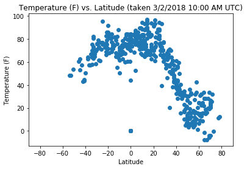
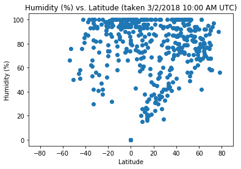
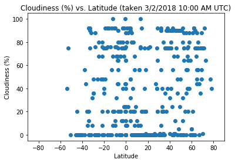

# 3 Observations:

1) Temperature indeed increases closer to 0 latitude and decreases farther away, especially around 60 degrees
2) The wind was faster in the Northern hemisphere at the time
3) Humidity is more likely to drop the closer you get to the equator
4) If you squint really hard, the plot of cloudiness looks like a knight riding a horse


```python
# Dependencies
import requests
import json
import random
import pandas as pd
import numpy as np
import matplotlib.pyplot as plt
from citipy import citipy
from secrets import future
```


```python
# Make a list of 501 cities chosen by random latitude and longitude

# Empty lists to be filled
city_list = []
country_code_list = []
lat_list = []
lon_list = []

# Until citylists is populated by 500 cities, keep doing things
while len(city_list) <= 500:
    lat = random.randint(-180, 181)
    lon = random.randint(-90, 91)
    city = citipy.nearest_city(lat, lon)
    if city.city_name not in city_list:
        city_list.append(city.city_name)
        country_code_list.append(city.country_code)
        lat_list.append(lat)
        lon_list.append(lon)
#print(citylist)
```


```python
# Make it a dataframe
weather_df = pd.DataFrame({"City Name": city_list, 
                        "Country Code": country_code_list, 
                        "Latitude": lat_list, 
                        "Longitude": lon_list,
                        "Temperature": "",
                        "Humidity (%)": "",
                        "Cloudiness (%)": "",
                        "Wind Speed": ""})
weather_df = weather_df[["City Name", "Country Code", "Latitude", "Longitude", "Temperature", "Humidity (%)", "Cloudiness (%)", "Wind Speed"]]
weather_df.head()
```


<div>
<style>
    .dataframe thead tr:only-child th {
        text-align: right;
    }

    .dataframe thead th {
        text-align: left;
    }

    .dataframe tbody tr th {
        vertical-align: top;
    }
</style>
<table border="1" class="dataframe">
  <thead>
    <tr style="text-align: right;">
      <th></th>
      <th>City Name</th>
      <th>Country Code</th>
      <th>Latitude</th>
      <th>Longitude</th>
      <th>Temperature</th>
      <th>Humidity (%)</th>
      <th>Cloudiness (%)</th>
      <th>Wind Speed</th>
    </tr>
  </thead>
  <tbody>
    <tr>
      <th>0</th>
      <td>mahebourg</td>
      <td>mu</td>
      <td>-23</td>
      <td>60</td>
      <td></td>
      <td></td>
      <td></td>
      <td></td>
    </tr>
    <tr>
      <th>1</th>
      <td>tokzar</td>
      <td>af</td>
      <td>36</td>
      <td>67</td>
      <td></td>
      <td></td>
      <td></td>
      <td></td>
    </tr>
    <tr>
      <th>2</th>
      <td>caravelas</td>
      <td>br</td>
      <td>-19</td>
      <td>-32</td>
      <td></td>
      <td></td>
      <td></td>
      <td></td>
    </tr>
    <tr>
      <th>3</th>
      <td>umm lajj</td>
      <td>sa</td>
      <td>25</td>
      <td>39</td>
      <td></td>
      <td></td>
      <td></td>
      <td></td>
    </tr>
    <tr>
      <th>4</th>
      <td>dikson</td>
      <td>ru</td>
      <td>145</td>
      <td>62</td>
      <td></td>
      <td></td>
      <td></td>
      <td></td>
    </tr>
  </tbody>
</table>
</div>


```python
# URL, prepare DataFrame
weather_url = "http://api.openweathermap.org/data/2.5/weather?q="

# GET THE WEATHER
for index, key in weather_df.iterrows():
    lat = 0
    lon = 0
    temperature = 0
    humidity = 0
    clouds = 0
    wind_speed = 0
    
    city = f"{key['City Name']},{key['Country Code']}"
    url = f"{weather_url}{city}&units=imperial&apikey={future}"
#     url = url.replace(" ", "+")

    # Take my api key out of the url that will be displayed
    safe_url = url.replace(future, "SECRET")
    
    # Print log
    print(f"Collecting data for city #{index}: {key['City Name']}")
    print(f"From URL: {safe_url}")
    json = requests.get(url).json()
    try:
        lat = json["coord"]["lat"]
        lon = json["coord"]["lon"]
        temperature = json["main"]["temp"]
        humidity = json["main"]["humidity"]
        clouds = json["clouds"]["all"]
        wind_speed = json["wind"]["speed"]
    except:
        print(f"Error Gathering Data for {city}")
    
    weather_df.set_value(index, "Latitude", lat)
    weather_df.set_value(index, "Longitude", lon)
    weather_df.set_value(index, "Temperature", temperature)
    weather_df.set_value(index, "Humidity (%)", humidity)
    weather_df.set_value(index, "Cloudiness (%)", clouds)
    weather_df.set_value(index, "Wind Speed", wind_speed)


print("------------------------")
print("Data collection complete")
```

    Collecting data for city #0: mahebourg
    From URL: http://api.openweathermap.org/data/2.5/weather?q=mahebourg,mu&units=imperial&apikey=SECRET
    Collecting data for city #1: tokzar
    From URL: http://api.openweathermap.org/data/2.5/weather?q=tokzar,af&units=imperial&apikey=SECRET
    Error Gathering Data for tokzar,af
    Collecting data for city #2: caravelas
    From URL: http://api.openweathermap.org/data/2.5/weather?q=caravelas,br&units=imperial&apikey=SECRET
    Collecting data for city #3: umm lajj
    From URL: http://api.openweathermap.org/data/2.5/weather?q=umm lajj,sa&units=imperial&apikey=SECRET
    Collecting data for city #4: dikson
    From URL: http://api.openweathermap.org/data/2.5/weather?q=dikson,ru&units=imperial&apikey=SECRET
    Collecting data for city #5: tasiilaq
    From URL: http://api.openweathermap.org/data/2.5/weather?q=tasiilaq,gl&units=imperial&apikey=SECRET
    Collecting data for city #6: cockburn town
    From URL: http://api.openweathermap.org/data/2.5/weather?q=cockburn town,tc&units=imperial&apikey=SECRET
    Collecting data for city #7: qaanaaq
    From URL: http://api.openweathermap.org/data/2.5/weather?q=qaanaaq,gl&units=imperial&apikey=SECRET
    Collecting data for city #8: port elizabeth
    From URL: http://api.openweathermap.org/data/2.5/weather?q=port elizabeth,za&units=imperial&apikey=SECRET
    Collecting data for city #9: hermanus
    From URL: http://api.openweathermap.org/data/2.5/weather?q=hermanus,za&units=imperial&apikey=SECRET
    Collecting data for city #10: san cristobal
    From URL: http://api.openweathermap.org/data/2.5/weather?q=san cristobal,ec&units=imperial&apikey=SECRET
    Collecting data for city #11: upernavik
    From URL: http://api.openweathermap.org/data/2.5/weather?q=upernavik,gl&units=imperial&apikey=SECRET
    Collecting data for city #12: longyearbyen
    From URL: http://api.openweathermap.org/data/2.5/weather?q=longyearbyen,sj&units=imperial&apikey=SECRET
    Collecting data for city #13: barentsburg
    From URL: http://api.openweathermap.org/data/2.5/weather?q=barentsburg,sj&units=imperial&apikey=SECRET
    Error Gathering Data for barentsburg,sj
    Collecting data for city #14: ancud
    From URL: http://api.openweathermap.org/data/2.5/weather?q=ancud,cl&units=imperial&apikey=SECRET
    Collecting data for city #15: cidreira
    From URL: http://api.openweathermap.org/data/2.5/weather?q=cidreira,br&units=imperial&apikey=SECRET
    Collecting data for city #16: ushuaia
    From URL: http://api.openweathermap.org/data/2.5/weather?q=ushuaia,ar&units=imperial&apikey=SECRET
    Collecting data for city #17: alaca
    From URL: http://api.openweathermap.org/data/2.5/weather?q=alaca,tr&units=imperial&apikey=SECRET
    Collecting data for city #18: vila do maio
    From URL: http://api.openweathermap.org/data/2.5/weather?q=vila do maio,cv&units=imperial&apikey=SECRET
    Collecting data for city #19: vygonichi
    From URL: http://api.openweathermap.org/data/2.5/weather?q=vygonichi,ru&units=imperial&apikey=SECRET
    Collecting data for city #20: saint george
    From URL: http://api.openweathermap.org/data/2.5/weather?q=saint george,bm&units=imperial&apikey=SECRET
    Collecting data for city #21: taolanaro
    From URL: http://api.openweathermap.org/data/2.5/weather?q=taolanaro,mg&units=imperial&apikey=SECRET
    Error Gathering Data for taolanaro,mg
    Collecting data for city #22: albany
    From URL: http://api.openweathermap.org/data/2.5/weather?q=albany,au&units=imperial&apikey=SECRET
    Collecting data for city #23: lisakovsk
    From URL: http://api.openweathermap.org/data/2.5/weather?q=lisakovsk,kz&units=imperial&apikey=SECRET
    Collecting data for city #24: port alfred
    From URL: http://api.openweathermap.org/data/2.5/weather?q=port alfred,za&units=imperial&apikey=SECRET
    Collecting data for city #25: teguise
    From URL: http://api.openweathermap.org/data/2.5/weather?q=teguise,es&units=imperial&apikey=SECRET
    Collecting data for city #26: goderich
    From URL: http://api.openweathermap.org/data/2.5/weather?q=goderich,sl&units=imperial&apikey=SECRET
    Error Gathering Data for goderich,sl
    Collecting data for city #27: bredasdorp
    From URL: http://api.openweathermap.org/data/2.5/weather?q=bredasdorp,za&units=imperial&apikey=SECRET
    Collecting data for city #28: krutinka
    From URL: http://api.openweathermap.org/data/2.5/weather?q=krutinka,ru&units=imperial&apikey=SECRET
    Collecting data for city #29: busselton
    From URL: http://api.openweathermap.org/data/2.5/weather?q=busselton,au&units=imperial&apikey=SECRET
    Collecting data for city #30: nuuk
    From URL: http://api.openweathermap.org/data/2.5/weather?q=nuuk,gl&units=imperial&apikey=SECRET
    Collecting data for city #31: victoria
    From URL: http://api.openweathermap.org/data/2.5/weather?q=victoria,sc&units=imperial&apikey=SECRET
    Collecting data for city #32: belushya guba
    From URL: http://api.openweathermap.org/data/2.5/weather?q=belushya guba,ru&units=imperial&apikey=SECRET
    Error Gathering Data for belushya guba,ru
    Collecting data for city #33: hithadhoo
    From URL: http://api.openweathermap.org/data/2.5/weather?q=hithadhoo,mv&units=imperial&apikey=SECRET
    Collecting data for city #34: sao joao da barra
    From URL: http://api.openweathermap.org/data/2.5/weather?q=sao joao da barra,br&units=imperial&apikey=SECRET
    Collecting data for city #35: pimentel
    From URL: http://api.openweathermap.org/data/2.5/weather?q=pimentel,pe&units=imperial&apikey=SECRET
    Collecting data for city #36: cape town
    From URL: http://api.openweathermap.org/data/2.5/weather?q=cape town,za&units=imperial&apikey=SECRET
    Collecting data for city #37: urdoma
    From URL: http://api.openweathermap.org/data/2.5/weather?q=urdoma,ru&units=imperial&apikey=SECRET
    Collecting data for city #38: necochea
    From URL: http://api.openweathermap.org/data/2.5/weather?q=necochea,ar&units=imperial&apikey=SECRET
    Collecting data for city #39: serik
    From URL: http://api.openweathermap.org/data/2.5/weather?q=serik,tr&units=imperial&apikey=SECRET
    Collecting data for city #40: sisimiut
    From URL: http://api.openweathermap.org/data/2.5/weather?q=sisimiut,gl&units=imperial&apikey=SECRET
    Collecting data for city #41: ostrovnoy
    From URL: http://api.openweathermap.org/data/2.5/weather?q=ostrovnoy,ru&units=imperial&apikey=SECRET
    Collecting data for city #42: colorado
    From URL: http://api.openweathermap.org/data/2.5/weather?q=colorado,br&units=imperial&apikey=SECRET
    Collecting data for city #43: ribeira grande
    From URL: http://api.openweathermap.org/data/2.5/weather?q=ribeira grande,pt&units=imperial&apikey=SECRET
    Collecting data for city #44: saint-philippe
    From URL: http://api.openweathermap.org/data/2.5/weather?q=saint-philippe,re&units=imperial&apikey=SECRET
    Collecting data for city #45: makokou
    From URL: http://api.openweathermap.org/data/2.5/weather?q=makokou,ga&units=imperial&apikey=SECRET
    Collecting data for city #46: tumannyy
    From URL: http://api.openweathermap.org/data/2.5/weather?q=tumannyy,ru&units=imperial&apikey=SECRET
    Error Gathering Data for tumannyy,ru
    Collecting data for city #47: illoqqortoormiut
    From URL: http://api.openweathermap.org/data/2.5/weather?q=illoqqortoormiut,gl&units=imperial&apikey=SECRET
    Error Gathering Data for illoqqortoormiut,gl
    Collecting data for city #48: shchelyayur
    From URL: http://api.openweathermap.org/data/2.5/weather?q=shchelyayur,ru&units=imperial&apikey=SECRET
    Error Gathering Data for shchelyayur,ru
    Collecting data for city #49: ormara
    From URL: http://api.openweathermap.org/data/2.5/weather?q=ormara,pk&units=imperial&apikey=SECRET
    Collecting data for city #50: georgetown
    From URL: http://api.openweathermap.org/data/2.5/weather?q=georgetown,sh&units=imperial&apikey=SECRET
    Collecting data for city #51: safranbolu
    From URL: http://api.openweathermap.org/data/2.5/weather?q=safranbolu,tr&units=imperial&apikey=SECRET
    Collecting data for city #52: jaen
    From URL: http://api.openweathermap.org/data/2.5/weather?q=jaen,pe&units=imperial&apikey=SECRET
    Collecting data for city #53: cap malheureux
    From URL: http://api.openweathermap.org/data/2.5/weather?q=cap malheureux,mu&units=imperial&apikey=SECRET
    Collecting data for city #54: casablanca
    From URL: http://api.openweathermap.org/data/2.5/weather?q=casablanca,ma&units=imperial&apikey=SECRET
    Collecting data for city #55: castro
    From URL: http://api.openweathermap.org/data/2.5/weather?q=castro,cl&units=imperial&apikey=SECRET
    Collecting data for city #56: jamestown
    From URL: http://api.openweathermap.org/data/2.5/weather?q=jamestown,sh&units=imperial&apikey=SECRET
    Collecting data for city #57: narsaq
    From URL: http://api.openweathermap.org/data/2.5/weather?q=narsaq,gl&units=imperial&apikey=SECRET
    Collecting data for city #58: klaksvik
    From URL: http://api.openweathermap.org/data/2.5/weather?q=klaksvik,fo&units=imperial&apikey=SECRET
    Collecting data for city #59: axim
    From URL: http://api.openweathermap.org/data/2.5/weather?q=axim,gh&units=imperial&apikey=SECRET
    Collecting data for city #60: bathsheba
    From URL: http://api.openweathermap.org/data/2.5/weather?q=bathsheba,bb&units=imperial&apikey=SECRET
    Collecting data for city #61: algiers
    From URL: http://api.openweathermap.org/data/2.5/weather?q=algiers,dz&units=imperial&apikey=SECRET
    Collecting data for city #62: torbay
    From URL: http://api.openweathermap.org/data/2.5/weather?q=torbay,ca&units=imperial&apikey=SECRET
    Collecting data for city #63: itarema
    From URL: http://api.openweathermap.org/data/2.5/weather?q=itarema,br&units=imperial&apikey=SECRET
    Collecting data for city #64: east london
    From URL: http://api.openweathermap.org/data/2.5/weather?q=east london,za&units=imperial&apikey=SECRET
    Collecting data for city #65: marsaxlokk
    From URL: http://api.openweathermap.org/data/2.5/weather?q=marsaxlokk,mt&units=imperial&apikey=SECRET
    Collecting data for city #66: baghdad
    From URL: http://api.openweathermap.org/data/2.5/weather?q=baghdad,iq&units=imperial&apikey=SECRET
    Collecting data for city #67: attawapiskat
    From URL: http://api.openweathermap.org/data/2.5/weather?q=attawapiskat,ca&units=imperial&apikey=SECRET
    Error Gathering Data for attawapiskat,ca
    Collecting data for city #68: niono
    From URL: http://api.openweathermap.org/data/2.5/weather?q=niono,ml&units=imperial&apikey=SECRET
    Collecting data for city #69: jatai
    From URL: http://api.openweathermap.org/data/2.5/weather?q=jatai,br&units=imperial&apikey=SECRET
    Collecting data for city #70: thinadhoo
    From URL: http://api.openweathermap.org/data/2.5/weather?q=thinadhoo,mv&units=imperial&apikey=SECRET
    Collecting data for city #71: vila velha
    From URL: http://api.openweathermap.org/data/2.5/weather?q=vila velha,br&units=imperial&apikey=SECRET
    Collecting data for city #72: agadez
    From URL: http://api.openweathermap.org/data/2.5/weather?q=agadez,ne&units=imperial&apikey=SECRET
    Collecting data for city #73: mecca
    From URL: http://api.openweathermap.org/data/2.5/weather?q=mecca,sa&units=imperial&apikey=SECRET
    Collecting data for city #74: darnah
    From URL: http://api.openweathermap.org/data/2.5/weather?q=darnah,ly&units=imperial&apikey=SECRET
    Collecting data for city #75: chimbote
    From URL: http://api.openweathermap.org/data/2.5/weather?q=chimbote,pe&units=imperial&apikey=SECRET
    Collecting data for city #76: luderitz
    From URL: http://api.openweathermap.org/data/2.5/weather?q=luderitz,na&units=imperial&apikey=SECRET
    Collecting data for city #77: souillac
    From URL: http://api.openweathermap.org/data/2.5/weather?q=souillac,mu&units=imperial&apikey=SECRET
    Collecting data for city #78: berlin
    From URL: http://api.openweathermap.org/data/2.5/weather?q=berlin,us&units=imperial&apikey=SECRET
    Collecting data for city #79: tiznit
    From URL: http://api.openweathermap.org/data/2.5/weather?q=tiznit,ma&units=imperial&apikey=SECRET
    Collecting data for city #80: viligili
    From URL: http://api.openweathermap.org/data/2.5/weather?q=viligili,mv&units=imperial&apikey=SECRET
    Error Gathering Data for viligili,mv
    Collecting data for city #81: benguela
    From URL: http://api.openweathermap.org/data/2.5/weather?q=benguela,ao&units=imperial&apikey=SECRET
    Collecting data for city #82: punta arenas
    From URL: http://api.openweathermap.org/data/2.5/weather?q=punta arenas,cl&units=imperial&apikey=SECRET
    Collecting data for city #83: orda
    From URL: http://api.openweathermap.org/data/2.5/weather?q=orda,ru&units=imperial&apikey=SECRET
    Collecting data for city #84: turukhansk
    From URL: http://api.openweathermap.org/data/2.5/weather?q=turukhansk,ru&units=imperial&apikey=SECRET
    Collecting data for city #85: havelock
    From URL: http://api.openweathermap.org/data/2.5/weather?q=havelock,us&units=imperial&apikey=SECRET
    Collecting data for city #86: alta floresta
    From URL: http://api.openweathermap.org/data/2.5/weather?q=alta floresta,br&units=imperial&apikey=SECRET
    Collecting data for city #87: novoleushkovskaya
    From URL: http://api.openweathermap.org/data/2.5/weather?q=novoleushkovskaya,ru&units=imperial&apikey=SECRET
    Collecting data for city #88: tevriz
    From URL: http://api.openweathermap.org/data/2.5/weather?q=tevriz,ru&units=imperial&apikey=SECRET
    Collecting data for city #89: grand river south east
    From URL: http://api.openweathermap.org/data/2.5/weather?q=grand river south east,mu&units=imperial&apikey=SECRET
    Error Gathering Data for grand river south east,mu
    Collecting data for city #90: toftir
    From URL: http://api.openweathermap.org/data/2.5/weather?q=toftir,fo&units=imperial&apikey=SECRET
    Error Gathering Data for toftir,fo
    Collecting data for city #91: chapais
    From URL: http://api.openweathermap.org/data/2.5/weather?q=chapais,ca&units=imperial&apikey=SECRET
    Collecting data for city #92: vieques
    From URL: http://api.openweathermap.org/data/2.5/weather?q=vieques,us&units=imperial&apikey=SECRET
    Error Gathering Data for vieques,us
    Collecting data for city #93: mar del plata
    From URL: http://api.openweathermap.org/data/2.5/weather?q=mar del plata,ar&units=imperial&apikey=SECRET
    Collecting data for city #94: saldanha
    From URL: http://api.openweathermap.org/data/2.5/weather?q=saldanha,za&units=imperial&apikey=SECRET
    Collecting data for city #95: dzerzhinsk
    From URL: http://api.openweathermap.org/data/2.5/weather?q=dzerzhinsk,by&units=imperial&apikey=SECRET
    Error Gathering Data for dzerzhinsk,by
    Collecting data for city #96: yacuiba
    From URL: http://api.openweathermap.org/data/2.5/weather?q=yacuiba,bo&units=imperial&apikey=SECRET
    Collecting data for city #97: ardabil
    From URL: http://api.openweathermap.org/data/2.5/weather?q=ardabil,ir&units=imperial&apikey=SECRET
    Collecting data for city #98: dakar
    From URL: http://api.openweathermap.org/data/2.5/weather?q=dakar,sn&units=imperial&apikey=SECRET
    Collecting data for city #99: amderma
    From URL: http://api.openweathermap.org/data/2.5/weather?q=amderma,ru&units=imperial&apikey=SECRET
    Error Gathering Data for amderma,ru
    Collecting data for city #100: simplicio mendes
    From URL: http://api.openweathermap.org/data/2.5/weather?q=simplicio mendes,br&units=imperial&apikey=SECRET
    Collecting data for city #101: kazalinsk
    From URL: http://api.openweathermap.org/data/2.5/weather?q=kazalinsk,kz&units=imperial&apikey=SECRET
    Error Gathering Data for kazalinsk,kz
    Collecting data for city #102: sao jose da coroa grande
    From URL: http://api.openweathermap.org/data/2.5/weather?q=sao jose da coroa grande,br&units=imperial&apikey=SECRET
    Collecting data for city #103: tabou
    From URL: http://api.openweathermap.org/data/2.5/weather?q=tabou,ci&units=imperial&apikey=SECRET
    Collecting data for city #104: tsihombe
    From URL: http://api.openweathermap.org/data/2.5/weather?q=tsihombe,mg&units=imperial&apikey=SECRET
    Error Gathering Data for tsihombe,mg
    Collecting data for city #105: lucea
    From URL: http://api.openweathermap.org/data/2.5/weather?q=lucea,jm&units=imperial&apikey=SECRET
    Collecting data for city #106: enterprise
    From URL: http://api.openweathermap.org/data/2.5/weather?q=enterprise,us&units=imperial&apikey=SECRET
    Collecting data for city #107: bobrovka
    From URL: http://api.openweathermap.org/data/2.5/weather?q=bobrovka,ru&units=imperial&apikey=SECRET
    Collecting data for city #108: messini
    From URL: http://api.openweathermap.org/data/2.5/weather?q=messini,gr&units=imperial&apikey=SECRET
    Collecting data for city #109: saint-pierre
    From URL: http://api.openweathermap.org/data/2.5/weather?q=saint-pierre,pm&units=imperial&apikey=SECRET
    Collecting data for city #110: rincon
    From URL: http://api.openweathermap.org/data/2.5/weather?q=rincon,an&units=imperial&apikey=SECRET
    Error Gathering Data for rincon,an
    Collecting data for city #111: mocuba
    From URL: http://api.openweathermap.org/data/2.5/weather?q=mocuba,mz&units=imperial&apikey=SECRET
    Collecting data for city #112: la romana
    From URL: http://api.openweathermap.org/data/2.5/weather?q=la romana,do&units=imperial&apikey=SECRET
    Collecting data for city #113: jupiter
    From URL: http://api.openweathermap.org/data/2.5/weather?q=jupiter,us&units=imperial&apikey=SECRET
    Collecting data for city #114: olafsvik
    From URL: http://api.openweathermap.org/data/2.5/weather?q=olafsvik,is&units=imperial&apikey=SECRET
    Error Gathering Data for olafsvik,is
    Collecting data for city #115: tasbuget
    From URL: http://api.openweathermap.org/data/2.5/weather?q=tasbuget,kz&units=imperial&apikey=SECRET
    Error Gathering Data for tasbuget,kz
    Collecting data for city #116: kruisfontein
    From URL: http://api.openweathermap.org/data/2.5/weather?q=kruisfontein,za&units=imperial&apikey=SECRET
    Collecting data for city #117: iqaluit
    From URL: http://api.openweathermap.org/data/2.5/weather?q=iqaluit,ca&units=imperial&apikey=SECRET
    Collecting data for city #118: bandarbeyla
    From URL: http://api.openweathermap.org/data/2.5/weather?q=bandarbeyla,so&units=imperial&apikey=SECRET
    Collecting data for city #119: belmonte
    From URL: http://api.openweathermap.org/data/2.5/weather?q=belmonte,br&units=imperial&apikey=SECRET
    Collecting data for city #120: urucara
    From URL: http://api.openweathermap.org/data/2.5/weather?q=urucara,br&units=imperial&apikey=SECRET
    Collecting data for city #121: berlevag
    From URL: http://api.openweathermap.org/data/2.5/weather?q=berlevag,no&units=imperial&apikey=SECRET
    Collecting data for city #122: navrongo
    From URL: http://api.openweathermap.org/data/2.5/weather?q=navrongo,gh&units=imperial&apikey=SECRET
    Collecting data for city #123: san miguel
    From URL: http://api.openweathermap.org/data/2.5/weather?q=san miguel,pa&units=imperial&apikey=SECRET
    Collecting data for city #124: buzmeyin
    From URL: http://api.openweathermap.org/data/2.5/weather?q=buzmeyin,tm&units=imperial&apikey=SECRET
    Collecting data for city #125: mocambique
    From URL: http://api.openweathermap.org/data/2.5/weather?q=mocambique,mz&units=imperial&apikey=SECRET
    Error Gathering Data for mocambique,mz
    Collecting data for city #126: bambous virieux
    From URL: http://api.openweathermap.org/data/2.5/weather?q=bambous virieux,mu&units=imperial&apikey=SECRET
    Collecting data for city #127: ilulissat
    From URL: http://api.openweathermap.org/data/2.5/weather?q=ilulissat,gl&units=imperial&apikey=SECRET
    Collecting data for city #128: marsabit
    From URL: http://api.openweathermap.org/data/2.5/weather?q=marsabit,ke&units=imperial&apikey=SECRET
    Collecting data for city #129: chapleau
    From URL: http://api.openweathermap.org/data/2.5/weather?q=chapleau,ca&units=imperial&apikey=SECRET
    Collecting data for city #130: moyale
    From URL: http://api.openweathermap.org/data/2.5/weather?q=moyale,ke&units=imperial&apikey=SECRET
    Collecting data for city #131: aconibe
    From URL: http://api.openweathermap.org/data/2.5/weather?q=aconibe,gq&units=imperial&apikey=SECRET
    Collecting data for city #132: nizwa
    From URL: http://api.openweathermap.org/data/2.5/weather?q=nizwa,om&units=imperial&apikey=SECRET
    Collecting data for city #133: cienfuegos
    From URL: http://api.openweathermap.org/data/2.5/weather?q=cienfuegos,cu&units=imperial&apikey=SECRET
    Collecting data for city #134: hobyo
    From URL: http://api.openweathermap.org/data/2.5/weather?q=hobyo,so&units=imperial&apikey=SECRET
    Collecting data for city #135: umzimvubu
    From URL: http://api.openweathermap.org/data/2.5/weather?q=umzimvubu,za&units=imperial&apikey=SECRET
    Error Gathering Data for umzimvubu,za
    Collecting data for city #136: cayenne
    From URL: http://api.openweathermap.org/data/2.5/weather?q=cayenne,gf&units=imperial&apikey=SECRET
    Collecting data for city #137: puerto asis
    From URL: http://api.openweathermap.org/data/2.5/weather?q=puerto asis,co&units=imperial&apikey=SECRET
    Collecting data for city #138: villa sandino
    From URL: http://api.openweathermap.org/data/2.5/weather?q=villa sandino,ni&units=imperial&apikey=SECRET
    Collecting data for city #139: namibe
    From URL: http://api.openweathermap.org/data/2.5/weather?q=namibe,ao&units=imperial&apikey=SECRET
    Collecting data for city #140: nawa
    From URL: http://api.openweathermap.org/data/2.5/weather?q=nawa,sy&units=imperial&apikey=SECRET
    Collecting data for city #141: talnakh
    From URL: http://api.openweathermap.org/data/2.5/weather?q=talnakh,ru&units=imperial&apikey=SECRET
    Collecting data for city #142: charlottetown
    From URL: http://api.openweathermap.org/data/2.5/weather?q=charlottetown,ca&units=imperial&apikey=SECRET
    Collecting data for city #143: hamilton
    From URL: http://api.openweathermap.org/data/2.5/weather?q=hamilton,bm&units=imperial&apikey=SECRET
    Collecting data for city #144: othonoi
    From URL: http://api.openweathermap.org/data/2.5/weather?q=othonoi,gr&units=imperial&apikey=SECRET
    Error Gathering Data for othonoi,gr
    Collecting data for city #145: waw
    From URL: http://api.openweathermap.org/data/2.5/weather?q=waw,sd&units=imperial&apikey=SECRET
    Error Gathering Data for waw,sd
    Collecting data for city #146: charagua
    From URL: http://api.openweathermap.org/data/2.5/weather?q=charagua,bo&units=imperial&apikey=SECRET
    Collecting data for city #147: huarmey
    From URL: http://api.openweathermap.org/data/2.5/weather?q=huarmey,pe&units=imperial&apikey=SECRET
    Collecting data for city #148: bubaque
    From URL: http://api.openweathermap.org/data/2.5/weather?q=bubaque,gw&units=imperial&apikey=SECRET
    Collecting data for city #149: veraval
    From URL: http://api.openweathermap.org/data/2.5/weather?q=veraval,in&units=imperial&apikey=SECRET
    Collecting data for city #150: krasnoselkup
    From URL: http://api.openweathermap.org/data/2.5/weather?q=krasnoselkup,ru&units=imperial&apikey=SECRET
    Error Gathering Data for krasnoselkup,ru
    Collecting data for city #151: ceahlau
    From URL: http://api.openweathermap.org/data/2.5/weather?q=ceahlau,ro&units=imperial&apikey=SECRET
    Collecting data for city #152: louisbourg
    From URL: http://api.openweathermap.org/data/2.5/weather?q=louisbourg,ca&units=imperial&apikey=SECRET
    Error Gathering Data for louisbourg,ca
    Collecting data for city #153: clyde river
    From URL: http://api.openweathermap.org/data/2.5/weather?q=clyde river,ca&units=imperial&apikey=SECRET
    Collecting data for city #154: dudinka
    From URL: http://api.openweathermap.org/data/2.5/weather?q=dudinka,ru&units=imperial&apikey=SECRET
    Collecting data for city #155: arraial do cabo
    From URL: http://api.openweathermap.org/data/2.5/weather?q=arraial do cabo,br&units=imperial&apikey=SECRET
    Collecting data for city #156: madaoua
    From URL: http://api.openweathermap.org/data/2.5/weather?q=madaoua,ne&units=imperial&apikey=SECRET
    Collecting data for city #157: carutapera
    From URL: http://api.openweathermap.org/data/2.5/weather?q=carutapera,br&units=imperial&apikey=SECRET
    Collecting data for city #158: monrovia
    From URL: http://api.openweathermap.org/data/2.5/weather?q=monrovia,lr&units=imperial&apikey=SECRET
    Collecting data for city #159: lima
    From URL: http://api.openweathermap.org/data/2.5/weather?q=lima,pe&units=imperial&apikey=SECRET
    Collecting data for city #160: mahanje
    From URL: http://api.openweathermap.org/data/2.5/weather?q=mahanje,tz&units=imperial&apikey=SECRET
    Error Gathering Data for mahanje,tz
    Collecting data for city #161: nioro
    From URL: http://api.openweathermap.org/data/2.5/weather?q=nioro,ml&units=imperial&apikey=SECRET
    Error Gathering Data for nioro,ml
    Collecting data for city #162: zhovkva
    From URL: http://api.openweathermap.org/data/2.5/weather?q=zhovkva,ua&units=imperial&apikey=SECRET
    Collecting data for city #163: salalah
    From URL: http://api.openweathermap.org/data/2.5/weather?q=salalah,om&units=imperial&apikey=SECRET
    Collecting data for city #164: tikrit
    From URL: http://api.openweathermap.org/data/2.5/weather?q=tikrit,iq&units=imperial&apikey=SECRET
    Collecting data for city #165: viedma
    From URL: http://api.openweathermap.org/data/2.5/weather?q=viedma,ar&units=imperial&apikey=SECRET
    Collecting data for city #166: buraydah
    From URL: http://api.openweathermap.org/data/2.5/weather?q=buraydah,sa&units=imperial&apikey=SECRET
    Collecting data for city #167: lahij
    From URL: http://api.openweathermap.org/data/2.5/weather?q=lahij,ye&units=imperial&apikey=SECRET
    Collecting data for city #168: olinda
    From URL: http://api.openweathermap.org/data/2.5/weather?q=olinda,br&units=imperial&apikey=SECRET
    Collecting data for city #169: tursunzoda
    From URL: http://api.openweathermap.org/data/2.5/weather?q=tursunzoda,tj&units=imperial&apikey=SECRET
    Collecting data for city #170: talcahuano
    From URL: http://api.openweathermap.org/data/2.5/weather?q=talcahuano,cl&units=imperial&apikey=SECRET
    Collecting data for city #171: husavik
    From URL: http://api.openweathermap.org/data/2.5/weather?q=husavik,is&units=imperial&apikey=SECRET
    Collecting data for city #172: padang
    From URL: http://api.openweathermap.org/data/2.5/weather?q=padang,id&units=imperial&apikey=SECRET
    Collecting data for city #173: placido de castro
    From URL: http://api.openweathermap.org/data/2.5/weather?q=placido de castro,br&units=imperial&apikey=SECRET
    Collecting data for city #174: natal
    From URL: http://api.openweathermap.org/data/2.5/weather?q=natal,br&units=imperial&apikey=SECRET
    Collecting data for city #175: port-gentil
    From URL: http://api.openweathermap.org/data/2.5/weather?q=port-gentil,ga&units=imperial&apikey=SECRET
    Collecting data for city #176: hunza
    From URL: http://api.openweathermap.org/data/2.5/weather?q=hunza,pk&units=imperial&apikey=SECRET
    Error Gathering Data for hunza,pk
    Collecting data for city #177: atar
    From URL: http://api.openweathermap.org/data/2.5/weather?q=atar,mr&units=imperial&apikey=SECRET
    Collecting data for city #178: kpandae
    From URL: http://api.openweathermap.org/data/2.5/weather?q=kpandae,gh&units=imperial&apikey=SECRET
    Collecting data for city #179: bousso
    From URL: http://api.openweathermap.org/data/2.5/weather?q=bousso,td&units=imperial&apikey=SECRET
    Collecting data for city #180: kingussie
    From URL: http://api.openweathermap.org/data/2.5/weather?q=kingussie,gb&units=imperial&apikey=SECRET
    Collecting data for city #181: freeport
    From URL: http://api.openweathermap.org/data/2.5/weather?q=freeport,bs&units=imperial&apikey=SECRET
    Collecting data for city #182: los llanos de aridane
    From URL: http://api.openweathermap.org/data/2.5/weather?q=los llanos de aridane,es&units=imperial&apikey=SECRET
    Collecting data for city #183: olbia
    From URL: http://api.openweathermap.org/data/2.5/weather?q=olbia,it&units=imperial&apikey=SECRET
    Collecting data for city #184: ponta do sol
    From URL: http://api.openweathermap.org/data/2.5/weather?q=ponta do sol,cv&units=imperial&apikey=SECRET
    Collecting data for city #185: rawson
    From URL: http://api.openweathermap.org/data/2.5/weather?q=rawson,ar&units=imperial&apikey=SECRET
    Collecting data for city #186: aswan
    From URL: http://api.openweathermap.org/data/2.5/weather?q=aswan,eg&units=imperial&apikey=SECRET
    Collecting data for city #187: dalvik
    From URL: http://api.openweathermap.org/data/2.5/weather?q=dalvik,is&units=imperial&apikey=SECRET
    Collecting data for city #188: khandbari
    From URL: http://api.openweathermap.org/data/2.5/weather?q=khandbari,np&units=imperial&apikey=SECRET
    Collecting data for city #189: netrakona
    From URL: http://api.openweathermap.org/data/2.5/weather?q=netrakona,bd&units=imperial&apikey=SECRET
    Collecting data for city #190: lebu
    From URL: http://api.openweathermap.org/data/2.5/weather?q=lebu,cl&units=imperial&apikey=SECRET
    Collecting data for city #191: jesup
    From URL: http://api.openweathermap.org/data/2.5/weather?q=jesup,us&units=imperial&apikey=SECRET
    Collecting data for city #192: srivardhan
    From URL: http://api.openweathermap.org/data/2.5/weather?q=srivardhan,in&units=imperial&apikey=SECRET
    Collecting data for city #193: mitsamiouli
    From URL: http://api.openweathermap.org/data/2.5/weather?q=mitsamiouli,km&units=imperial&apikey=SECRET
    Collecting data for city #194: manikpur
    From URL: http://api.openweathermap.org/data/2.5/weather?q=manikpur,in&units=imperial&apikey=SECRET
    Collecting data for city #195: faya
    From URL: http://api.openweathermap.org/data/2.5/weather?q=faya,td&units=imperial&apikey=SECRET
    Error Gathering Data for faya,td
    Collecting data for city #196: honningsvag
    From URL: http://api.openweathermap.org/data/2.5/weather?q=honningsvag,no&units=imperial&apikey=SECRET
    Collecting data for city #197: segovia
    From URL: http://api.openweathermap.org/data/2.5/weather?q=segovia,es&units=imperial&apikey=SECRET
    Collecting data for city #198: vardo
    From URL: http://api.openweathermap.org/data/2.5/weather?q=vardo,no&units=imperial&apikey=SECRET
    Collecting data for city #199: rio gallegos
    From URL: http://api.openweathermap.org/data/2.5/weather?q=rio gallegos,ar&units=imperial&apikey=SECRET
    Collecting data for city #200: coihaique
    From URL: http://api.openweathermap.org/data/2.5/weather?q=coihaique,cl&units=imperial&apikey=SECRET
    Collecting data for city #201: jaicos
    From URL: http://api.openweathermap.org/data/2.5/weather?q=jaicos,br&units=imperial&apikey=SECRET
    Collecting data for city #202: kati
    From URL: http://api.openweathermap.org/data/2.5/weather?q=kati,ml&units=imperial&apikey=SECRET
    Collecting data for city #203: shieli
    From URL: http://api.openweathermap.org/data/2.5/weather?q=shieli,kz&units=imperial&apikey=SECRET
    Collecting data for city #204: hvolsvollur
    From URL: http://api.openweathermap.org/data/2.5/weather?q=hvolsvollur,is&units=imperial&apikey=SECRET
    Error Gathering Data for hvolsvollur,is
    Collecting data for city #205: rafsanjan
    From URL: http://api.openweathermap.org/data/2.5/weather?q=rafsanjan,ir&units=imperial&apikey=SECRET
    Collecting data for city #206: chimore
    From URL: http://api.openweathermap.org/data/2.5/weather?q=chimore,bo&units=imperial&apikey=SECRET
    Collecting data for city #207: nouadhibou
    From URL: http://api.openweathermap.org/data/2.5/weather?q=nouadhibou,mr&units=imperial&apikey=SECRET
    Collecting data for city #208: menzelinsk
    From URL: http://api.openweathermap.org/data/2.5/weather?q=menzelinsk,ru&units=imperial&apikey=SECRET
    Collecting data for city #209: deer lake
    From URL: http://api.openweathermap.org/data/2.5/weather?q=deer lake,ca&units=imperial&apikey=SECRET
    Collecting data for city #210: glencoe
    From URL: http://api.openweathermap.org/data/2.5/weather?q=glencoe,za&units=imperial&apikey=SECRET
    Collecting data for city #211: iraucuba
    From URL: http://api.openweathermap.org/data/2.5/weather?q=iraucuba,br&units=imperial&apikey=SECRET
    Collecting data for city #212: vytegra
    From URL: http://api.openweathermap.org/data/2.5/weather?q=vytegra,ru&units=imperial&apikey=SECRET
    Collecting data for city #213: kutum
    From URL: http://api.openweathermap.org/data/2.5/weather?q=kutum,sd&units=imperial&apikey=SECRET
    Collecting data for city #214: jibuti
    From URL: http://api.openweathermap.org/data/2.5/weather?q=jibuti,dj&units=imperial&apikey=SECRET
    Error Gathering Data for jibuti,dj
    Collecting data for city #215: maceio
    From URL: http://api.openweathermap.org/data/2.5/weather?q=maceio,br&units=imperial&apikey=SECRET
    Collecting data for city #216: batsfjord
    From URL: http://api.openweathermap.org/data/2.5/weather?q=batsfjord,no&units=imperial&apikey=SECRET
    Collecting data for city #217: alice town
    From URL: http://api.openweathermap.org/data/2.5/weather?q=alice town,bs&units=imperial&apikey=SECRET
    Collecting data for city #218: balatonalmadi
    From URL: http://api.openweathermap.org/data/2.5/weather?q=balatonalmadi,hu&units=imperial&apikey=SECRET
    Collecting data for city #219: abu samrah
    From URL: http://api.openweathermap.org/data/2.5/weather?q=abu samrah,qa&units=imperial&apikey=SECRET
    Error Gathering Data for abu samrah,qa
    Collecting data for city #220: nanortalik
    From URL: http://api.openweathermap.org/data/2.5/weather?q=nanortalik,gl&units=imperial&apikey=SECRET
    Collecting data for city #221: qaqortoq
    From URL: http://api.openweathermap.org/data/2.5/weather?q=qaqortoq,gl&units=imperial&apikey=SECRET
    Collecting data for city #222: westport
    From URL: http://api.openweathermap.org/data/2.5/weather?q=westport,ie&units=imperial&apikey=SECRET
    Collecting data for city #223: maridi
    From URL: http://api.openweathermap.org/data/2.5/weather?q=maridi,sd&units=imperial&apikey=SECRET
    Error Gathering Data for maridi,sd
    Collecting data for city #224: alekseyevka
    From URL: http://api.openweathermap.org/data/2.5/weather?q=alekseyevka,ru&units=imperial&apikey=SECRET
    Collecting data for city #225: garowe
    From URL: http://api.openweathermap.org/data/2.5/weather?q=garowe,so&units=imperial&apikey=SECRET
    Collecting data for city #226: warqla
    From URL: http://api.openweathermap.org/data/2.5/weather?q=warqla,dz&units=imperial&apikey=SECRET
    Error Gathering Data for warqla,dz
    Collecting data for city #227: muli
    From URL: http://api.openweathermap.org/data/2.5/weather?q=muli,mv&units=imperial&apikey=SECRET
    Collecting data for city #228: jatibonico
    From URL: http://api.openweathermap.org/data/2.5/weather?q=jatibonico,cu&units=imperial&apikey=SECRET
    Collecting data for city #229: taoudenni
    From URL: http://api.openweathermap.org/data/2.5/weather?q=taoudenni,ml&units=imperial&apikey=SECRET
    Collecting data for city #230: azar shahr
    From URL: http://api.openweathermap.org/data/2.5/weather?q=azar shahr,ir&units=imperial&apikey=SECRET
    Error Gathering Data for azar shahr,ir
    Collecting data for city #231: turayf
    From URL: http://api.openweathermap.org/data/2.5/weather?q=turayf,sa&units=imperial&apikey=SECRET
    Collecting data for city #232: yantzaza
    From URL: http://api.openweathermap.org/data/2.5/weather?q=yantzaza,ec&units=imperial&apikey=SECRET
    Collecting data for city #233: mamallapuram
    From URL: http://api.openweathermap.org/data/2.5/weather?q=mamallapuram,in&units=imperial&apikey=SECRET
    Collecting data for city #234: bhaderwah
    From URL: http://api.openweathermap.org/data/2.5/weather?q=bhaderwah,in&units=imperial&apikey=SECRET
    Collecting data for city #235: uba
    From URL: http://api.openweathermap.org/data/2.5/weather?q=uba,br&units=imperial&apikey=SECRET
    Error Gathering Data for uba,br
    Collecting data for city #236: gbarnga
    From URL: http://api.openweathermap.org/data/2.5/weather?q=gbarnga,lr&units=imperial&apikey=SECRET
    Collecting data for city #237: marsh harbour
    From URL: http://api.openweathermap.org/data/2.5/weather?q=marsh harbour,bs&units=imperial&apikey=SECRET
    Collecting data for city #238: petit goave
    From URL: http://api.openweathermap.org/data/2.5/weather?q=petit goave,ht&units=imperial&apikey=SECRET
    Collecting data for city #239: kegayli
    From URL: http://api.openweathermap.org/data/2.5/weather?q=kegayli,uz&units=imperial&apikey=SECRET
    Error Gathering Data for kegayli,uz
    Collecting data for city #240: hami
    From URL: http://api.openweathermap.org/data/2.5/weather?q=hami,cn&units=imperial&apikey=SECRET
    Collecting data for city #241: roald
    From URL: http://api.openweathermap.org/data/2.5/weather?q=roald,no&units=imperial&apikey=SECRET
    Collecting data for city #242: ijsselstein
    From URL: http://api.openweathermap.org/data/2.5/weather?q=ijsselstein,nl&units=imperial&apikey=SECRET
    Collecting data for city #243: bara
    From URL: http://api.openweathermap.org/data/2.5/weather?q=bara,sd&units=imperial&apikey=SECRET
    Error Gathering Data for bara,sd
    Collecting data for city #244: port-cartier
    From URL: http://api.openweathermap.org/data/2.5/weather?q=port-cartier,ca&units=imperial&apikey=SECRET
    Collecting data for city #245: saint anthony
    From URL: http://api.openweathermap.org/data/2.5/weather?q=saint anthony,ca&units=imperial&apikey=SECRET
    Error Gathering Data for saint anthony,ca
    Collecting data for city #246: mariestad
    From URL: http://api.openweathermap.org/data/2.5/weather?q=mariestad,se&units=imperial&apikey=SECRET
    Collecting data for city #247: tucuman
    From URL: http://api.openweathermap.org/data/2.5/weather?q=tucuman,ar&units=imperial&apikey=SECRET
    Error Gathering Data for tucuman,ar
    Collecting data for city #248: manoel urbano
    From URL: http://api.openweathermap.org/data/2.5/weather?q=manoel urbano,br&units=imperial&apikey=SECRET
    Collecting data for city #249: sao filipe
    From URL: http://api.openweathermap.org/data/2.5/weather?q=sao filipe,cv&units=imperial&apikey=SECRET
    Collecting data for city #250: eenhana
    From URL: http://api.openweathermap.org/data/2.5/weather?q=eenhana,na&units=imperial&apikey=SECRET
    Collecting data for city #251: wloszczowa
    From URL: http://api.openweathermap.org/data/2.5/weather?q=wloszczowa,pl&units=imperial&apikey=SECRET
    Collecting data for city #252: bengkulu
    From URL: http://api.openweathermap.org/data/2.5/weather?q=bengkulu,id&units=imperial&apikey=SECRET
    Error Gathering Data for bengkulu,id
    Collecting data for city #253: port blair
    From URL: http://api.openweathermap.org/data/2.5/weather?q=port blair,in&units=imperial&apikey=SECRET
    Collecting data for city #254: akureyri
    From URL: http://api.openweathermap.org/data/2.5/weather?q=akureyri,is&units=imperial&apikey=SECRET
    Collecting data for city #255: san carlos de bariloche
    From URL: http://api.openweathermap.org/data/2.5/weather?q=san carlos de bariloche,ar&units=imperial&apikey=SECRET
    Collecting data for city #256: beisfjord
    From URL: http://api.openweathermap.org/data/2.5/weather?q=beisfjord,no&units=imperial&apikey=SECRET
    Collecting data for city #257: sorvag
    From URL: http://api.openweathermap.org/data/2.5/weather?q=sorvag,fo&units=imperial&apikey=SECRET
    Error Gathering Data for sorvag,fo
    Collecting data for city #258: henties bay
    From URL: http://api.openweathermap.org/data/2.5/weather?q=henties bay,na&units=imperial&apikey=SECRET
    Collecting data for city #259: dingle
    From URL: http://api.openweathermap.org/data/2.5/weather?q=dingle,ie&units=imperial&apikey=SECRET
    Collecting data for city #260: hvide sande
    From URL: http://api.openweathermap.org/data/2.5/weather?q=hvide sande,dk&units=imperial&apikey=SECRET
    Collecting data for city #261: nantucket
    From URL: http://api.openweathermap.org/data/2.5/weather?q=nantucket,us&units=imperial&apikey=SECRET
    Collecting data for city #262: richards bay
    From URL: http://api.openweathermap.org/data/2.5/weather?q=richards bay,za&units=imperial&apikey=SECRET
    Collecting data for city #263: quatre cocos
    From URL: http://api.openweathermap.org/data/2.5/weather?q=quatre cocos,mu&units=imperial&apikey=SECRET
    Collecting data for city #264: bosaso
    From URL: http://api.openweathermap.org/data/2.5/weather?q=bosaso,so&units=imperial&apikey=SECRET
    Collecting data for city #265: hammerfest
    From URL: http://api.openweathermap.org/data/2.5/weather?q=hammerfest,no&units=imperial&apikey=SECRET
    Collecting data for city #266: wajir
    From URL: http://api.openweathermap.org/data/2.5/weather?q=wajir,ke&units=imperial&apikey=SECRET
    Collecting data for city #267: terra roxa
    From URL: http://api.openweathermap.org/data/2.5/weather?q=terra roxa,br&units=imperial&apikey=SECRET
    Collecting data for city #268: tabas
    From URL: http://api.openweathermap.org/data/2.5/weather?q=tabas,ir&units=imperial&apikey=SECRET
    Collecting data for city #269: gat
    From URL: http://api.openweathermap.org/data/2.5/weather?q=gat,ly&units=imperial&apikey=SECRET
    Error Gathering Data for gat,ly
    Collecting data for city #270: zhezkazgan
    From URL: http://api.openweathermap.org/data/2.5/weather?q=zhezkazgan,kz&units=imperial&apikey=SECRET
    Collecting data for city #271: khormuj
    From URL: http://api.openweathermap.org/data/2.5/weather?q=khormuj,ir&units=imperial&apikey=SECRET
    Error Gathering Data for khormuj,ir
    Collecting data for city #272: yei
    From URL: http://api.openweathermap.org/data/2.5/weather?q=yei,sd&units=imperial&apikey=SECRET
    Error Gathering Data for yei,sd
    Collecting data for city #273: kamenka
    From URL: http://api.openweathermap.org/data/2.5/weather?q=kamenka,ru&units=imperial&apikey=SECRET
    Collecting data for city #274: eufaula
    From URL: http://api.openweathermap.org/data/2.5/weather?q=eufaula,us&units=imperial&apikey=SECRET
    Collecting data for city #275: corn island
    From URL: http://api.openweathermap.org/data/2.5/weather?q=corn island,ni&units=imperial&apikey=SECRET
    Collecting data for city #276: rio grande
    From URL: http://api.openweathermap.org/data/2.5/weather?q=rio grande,br&units=imperial&apikey=SECRET
    Collecting data for city #277: boke
    From URL: http://api.openweathermap.org/data/2.5/weather?q=boke,gn&units=imperial&apikey=SECRET
    Collecting data for city #278: farafangana
    From URL: http://api.openweathermap.org/data/2.5/weather?q=farafangana,mg&units=imperial&apikey=SECRET
    Collecting data for city #279: praia da vitoria
    From URL: http://api.openweathermap.org/data/2.5/weather?q=praia da vitoria,pt&units=imperial&apikey=SECRET
    Collecting data for city #280: jalu
    From URL: http://api.openweathermap.org/data/2.5/weather?q=jalu,ly&units=imperial&apikey=SECRET
    Collecting data for city #281: chingirlau
    From URL: http://api.openweathermap.org/data/2.5/weather?q=chingirlau,kz&units=imperial&apikey=SECRET
    Collecting data for city #282: campo verde
    From URL: http://api.openweathermap.org/data/2.5/weather?q=campo verde,br&units=imperial&apikey=SECRET
    Collecting data for city #283: mehamn
    From URL: http://api.openweathermap.org/data/2.5/weather?q=mehamn,no&units=imperial&apikey=SECRET
    Collecting data for city #284: maragogi
    From URL: http://api.openweathermap.org/data/2.5/weather?q=maragogi,br&units=imperial&apikey=SECRET
    Collecting data for city #285: gberia fotombu
    From URL: http://api.openweathermap.org/data/2.5/weather?q=gberia fotombu,sl&units=imperial&apikey=SECRET
    Collecting data for city #286: pastavy
    From URL: http://api.openweathermap.org/data/2.5/weather?q=pastavy,by&units=imperial&apikey=SECRET
    Collecting data for city #287: astana
    From URL: http://api.openweathermap.org/data/2.5/weather?q=astana,kz&units=imperial&apikey=SECRET
    Collecting data for city #288: kavali
    From URL: http://api.openweathermap.org/data/2.5/weather?q=kavali,in&units=imperial&apikey=SECRET
    Collecting data for city #289: kapiri mposhi
    From URL: http://api.openweathermap.org/data/2.5/weather?q=kapiri mposhi,zm&units=imperial&apikey=SECRET
    Collecting data for city #290: marzuq
    From URL: http://api.openweathermap.org/data/2.5/weather?q=marzuq,ly&units=imperial&apikey=SECRET
    Error Gathering Data for marzuq,ly
    Collecting data for city #291: gondar
    From URL: http://api.openweathermap.org/data/2.5/weather?q=gondar,et&units=imperial&apikey=SECRET
    Error Gathering Data for gondar,et
    Collecting data for city #292: abnub
    From URL: http://api.openweathermap.org/data/2.5/weather?q=abnub,eg&units=imperial&apikey=SECRET
    Collecting data for city #293: urucui
    From URL: http://api.openweathermap.org/data/2.5/weather?q=urucui,br&units=imperial&apikey=SECRET
    Collecting data for city #294: sambava
    From URL: http://api.openweathermap.org/data/2.5/weather?q=sambava,mg&units=imperial&apikey=SECRET
    Collecting data for city #295: oranjestad
    From URL: http://api.openweathermap.org/data/2.5/weather?q=oranjestad,aw&units=imperial&apikey=SECRET
    Collecting data for city #296: chuy
    From URL: http://api.openweathermap.org/data/2.5/weather?q=chuy,uy&units=imperial&apikey=SECRET
    Collecting data for city #297: akyab
    From URL: http://api.openweathermap.org/data/2.5/weather?q=akyab,mm&units=imperial&apikey=SECRET
    Error Gathering Data for akyab,mm
    Collecting data for city #298: skibbereen
    From URL: http://api.openweathermap.org/data/2.5/weather?q=skibbereen,ie&units=imperial&apikey=SECRET
    Collecting data for city #299: tornio
    From URL: http://api.openweathermap.org/data/2.5/weather?q=tornio,fi&units=imperial&apikey=SECRET
    Collecting data for city #300: witbank
    From URL: http://api.openweathermap.org/data/2.5/weather?q=witbank,za&units=imperial&apikey=SECRET
    Collecting data for city #301: waddan
    From URL: http://api.openweathermap.org/data/2.5/weather?q=waddan,ly&units=imperial&apikey=SECRET
    Collecting data for city #302: adelaide
    From URL: http://api.openweathermap.org/data/2.5/weather?q=adelaide,za&units=imperial&apikey=SECRET
    Collecting data for city #303: kalmunai
    From URL: http://api.openweathermap.org/data/2.5/weather?q=kalmunai,lk&units=imperial&apikey=SECRET
    Collecting data for city #304: raipur
    From URL: http://api.openweathermap.org/data/2.5/weather?q=raipur,in&units=imperial&apikey=SECRET
    Collecting data for city #305: touros
    From URL: http://api.openweathermap.org/data/2.5/weather?q=touros,br&units=imperial&apikey=SECRET
    Collecting data for city #306: zaysan
    From URL: http://api.openweathermap.org/data/2.5/weather?q=zaysan,kz&units=imperial&apikey=SECRET
    Collecting data for city #307: morros
    From URL: http://api.openweathermap.org/data/2.5/weather?q=morros,br&units=imperial&apikey=SECRET
    Collecting data for city #308: leshukonskoye
    From URL: http://api.openweathermap.org/data/2.5/weather?q=leshukonskoye,ru&units=imperial&apikey=SECRET
    Collecting data for city #309: manama
    From URL: http://api.openweathermap.org/data/2.5/weather?q=manama,bh&units=imperial&apikey=SECRET
    Collecting data for city #310: urengoy
    From URL: http://api.openweathermap.org/data/2.5/weather?q=urengoy,ru&units=imperial&apikey=SECRET
    Collecting data for city #311: svetlyy
    From URL: http://api.openweathermap.org/data/2.5/weather?q=svetlyy,ru&units=imperial&apikey=SECRET
    Error Gathering Data for svetlyy,ru
    Collecting data for city #312: amarpur
    From URL: http://api.openweathermap.org/data/2.5/weather?q=amarpur,in&units=imperial&apikey=SECRET
    Collecting data for city #313: najran
    From URL: http://api.openweathermap.org/data/2.5/weather?q=najran,sa&units=imperial&apikey=SECRET
    Collecting data for city #314: dombarovskiy
    From URL: http://api.openweathermap.org/data/2.5/weather?q=dombarovskiy,ru&units=imperial&apikey=SECRET
    Collecting data for city #315: dori
    From URL: http://api.openweathermap.org/data/2.5/weather?q=dori,bf&units=imperial&apikey=SECRET
    Collecting data for city #316: adrar
    From URL: http://api.openweathermap.org/data/2.5/weather?q=adrar,dz&units=imperial&apikey=SECRET
    Collecting data for city #317: asayita
    From URL: http://api.openweathermap.org/data/2.5/weather?q=asayita,et&units=imperial&apikey=SECRET
    Error Gathering Data for asayita,et
    Collecting data for city #318: urdzhar
    From URL: http://api.openweathermap.org/data/2.5/weather?q=urdzhar,kz&units=imperial&apikey=SECRET
    Error Gathering Data for urdzhar,kz
    Collecting data for city #319: hollins
    From URL: http://api.openweathermap.org/data/2.5/weather?q=hollins,us&units=imperial&apikey=SECRET
    Collecting data for city #320: manaure
    From URL: http://api.openweathermap.org/data/2.5/weather?q=manaure,co&units=imperial&apikey=SECRET
    Collecting data for city #321: bargal
    From URL: http://api.openweathermap.org/data/2.5/weather?q=bargal,so&units=imperial&apikey=SECRET
    Error Gathering Data for bargal,so
    Collecting data for city #322: comodoro rivadavia
    From URL: http://api.openweathermap.org/data/2.5/weather?q=comodoro rivadavia,ar&units=imperial&apikey=SECRET
    Collecting data for city #323: toamasina
    From URL: http://api.openweathermap.org/data/2.5/weather?q=toamasina,mg&units=imperial&apikey=SECRET
    Collecting data for city #324: mitu
    From URL: http://api.openweathermap.org/data/2.5/weather?q=mitu,co&units=imperial&apikey=SECRET
    Collecting data for city #325: chany
    From URL: http://api.openweathermap.org/data/2.5/weather?q=chany,ru&units=imperial&apikey=SECRET
    Collecting data for city #326: esmeraldas
    From URL: http://api.openweathermap.org/data/2.5/weather?q=esmeraldas,ec&units=imperial&apikey=SECRET
    Collecting data for city #327: staryy biser
    From URL: http://api.openweathermap.org/data/2.5/weather?q=staryy biser,ru&units=imperial&apikey=SECRET
    Error Gathering Data for staryy biser,ru
    Collecting data for city #328: ambilobe
    From URL: http://api.openweathermap.org/data/2.5/weather?q=ambilobe,mg&units=imperial&apikey=SECRET
    Collecting data for city #329: maniitsoq
    From URL: http://api.openweathermap.org/data/2.5/weather?q=maniitsoq,gl&units=imperial&apikey=SECRET
    Collecting data for city #330: sovetskiy
    From URL: http://api.openweathermap.org/data/2.5/weather?q=sovetskiy,ru&units=imperial&apikey=SECRET
    Collecting data for city #331: farah
    From URL: http://api.openweathermap.org/data/2.5/weather?q=farah,af&units=imperial&apikey=SECRET
    Collecting data for city #332: humaita
    From URL: http://api.openweathermap.org/data/2.5/weather?q=humaita,br&units=imperial&apikey=SECRET
    Error Gathering Data for humaita,br
    Collecting data for city #333: grindavik
    From URL: http://api.openweathermap.org/data/2.5/weather?q=grindavik,is&units=imperial&apikey=SECRET
    Collecting data for city #334: karakose
    From URL: http://api.openweathermap.org/data/2.5/weather?q=karakose,tr&units=imperial&apikey=SECRET
    Error Gathering Data for karakose,tr
    Collecting data for city #335: meulaboh
    From URL: http://api.openweathermap.org/data/2.5/weather?q=meulaboh,id&units=imperial&apikey=SECRET
    Collecting data for city #336: hualmay
    From URL: http://api.openweathermap.org/data/2.5/weather?q=hualmay,pe&units=imperial&apikey=SECRET
    Collecting data for city #337: badarganj
    From URL: http://api.openweathermap.org/data/2.5/weather?q=badarganj,bd&units=imperial&apikey=SECRET
    Collecting data for city #338: havre-saint-pierre
    From URL: http://api.openweathermap.org/data/2.5/weather?q=havre-saint-pierre,ca&units=imperial&apikey=SECRET
    Collecting data for city #339: rafaela
    From URL: http://api.openweathermap.org/data/2.5/weather?q=rafaela,ar&units=imperial&apikey=SECRET
    Collecting data for city #340: thunder bay
    From URL: http://api.openweathermap.org/data/2.5/weather?q=thunder bay,ca&units=imperial&apikey=SECRET
    Collecting data for city #341: paita
    From URL: http://api.openweathermap.org/data/2.5/weather?q=paita,pe&units=imperial&apikey=SECRET
    Collecting data for city #342: usinsk
    From URL: http://api.openweathermap.org/data/2.5/weather?q=usinsk,ru&units=imperial&apikey=SECRET
    Collecting data for city #343: mzimba
    From URL: http://api.openweathermap.org/data/2.5/weather?q=mzimba,mw&units=imperial&apikey=SECRET
    Collecting data for city #344: xai-xai
    From URL: http://api.openweathermap.org/data/2.5/weather?q=xai-xai,mz&units=imperial&apikey=SECRET
    Collecting data for city #345: liverpool
    From URL: http://api.openweathermap.org/data/2.5/weather?q=liverpool,ca&units=imperial&apikey=SECRET
    Collecting data for city #346: ferkessedougou
    From URL: http://api.openweathermap.org/data/2.5/weather?q=ferkessedougou,ci&units=imperial&apikey=SECRET
    Collecting data for city #347: kidal
    From URL: http://api.openweathermap.org/data/2.5/weather?q=kidal,ml&units=imperial&apikey=SECRET
    Collecting data for city #348: pital
    From URL: http://api.openweathermap.org/data/2.5/weather?q=pital,cr&units=imperial&apikey=SECRET
    Collecting data for city #349: banda aceh
    From URL: http://api.openweathermap.org/data/2.5/weather?q=banda aceh,id&units=imperial&apikey=SECRET
    Collecting data for city #350: cochrane
    From URL: http://api.openweathermap.org/data/2.5/weather?q=cochrane,ca&units=imperial&apikey=SECRET
    Collecting data for city #351: arroyo
    From URL: http://api.openweathermap.org/data/2.5/weather?q=arroyo,us&units=imperial&apikey=SECRET
    Collecting data for city #352: tadpatri
    From URL: http://api.openweathermap.org/data/2.5/weather?q=tadpatri,in&units=imperial&apikey=SECRET
    Collecting data for city #353: ibotirama
    From URL: http://api.openweathermap.org/data/2.5/weather?q=ibotirama,br&units=imperial&apikey=SECRET
    Collecting data for city #354: cape coast
    From URL: http://api.openweathermap.org/data/2.5/weather?q=cape coast,gh&units=imperial&apikey=SECRET
    Collecting data for city #355: puerto ayora
    From URL: http://api.openweathermap.org/data/2.5/weather?q=puerto ayora,ec&units=imperial&apikey=SECRET
    Collecting data for city #356: watertown
    From URL: http://api.openweathermap.org/data/2.5/weather?q=watertown,us&units=imperial&apikey=SECRET
    Collecting data for city #357: djenne
    From URL: http://api.openweathermap.org/data/2.5/weather?q=djenne,ml&units=imperial&apikey=SECRET
    Collecting data for city #358: chicama
    From URL: http://api.openweathermap.org/data/2.5/weather?q=chicama,pe&units=imperial&apikey=SECRET
    Collecting data for city #359: tete
    From URL: http://api.openweathermap.org/data/2.5/weather?q=tete,mz&units=imperial&apikey=SECRET
    Collecting data for city #360: kuytun
    From URL: http://api.openweathermap.org/data/2.5/weather?q=kuytun,cn&units=imperial&apikey=SECRET
    Error Gathering Data for kuytun,cn
    Collecting data for city #361: porosozero
    From URL: http://api.openweathermap.org/data/2.5/weather?q=porosozero,ru&units=imperial&apikey=SECRET
    Collecting data for city #362: gamboma
    From URL: http://api.openweathermap.org/data/2.5/weather?q=gamboma,cg&units=imperial&apikey=SECRET
    Collecting data for city #363: morondava
    From URL: http://api.openweathermap.org/data/2.5/weather?q=morondava,mg&units=imperial&apikey=SECRET
    Collecting data for city #364: conceicao do araguaia
    From URL: http://api.openweathermap.org/data/2.5/weather?q=conceicao do araguaia,br&units=imperial&apikey=SECRET
    Collecting data for city #365: camocim
    From URL: http://api.openweathermap.org/data/2.5/weather?q=camocim,br&units=imperial&apikey=SECRET
    Collecting data for city #366: piacabucu
    From URL: http://api.openweathermap.org/data/2.5/weather?q=piacabucu,br&units=imperial&apikey=SECRET
    Collecting data for city #367: sabha
    From URL: http://api.openweathermap.org/data/2.5/weather?q=sabha,jo&units=imperial&apikey=SECRET
    Collecting data for city #368: aflu
    From URL: http://api.openweathermap.org/data/2.5/weather?q=aflu,dz&units=imperial&apikey=SECRET
    Error Gathering Data for aflu,dz
    Collecting data for city #369: saint-georges
    From URL: http://api.openweathermap.org/data/2.5/weather?q=saint-georges,gf&units=imperial&apikey=SECRET
    Error Gathering Data for saint-georges,gf
    Collecting data for city #370: pozo colorado
    From URL: http://api.openweathermap.org/data/2.5/weather?q=pozo colorado,py&units=imperial&apikey=SECRET
    Collecting data for city #371: grand gaube
    From URL: http://api.openweathermap.org/data/2.5/weather?q=grand gaube,mu&units=imperial&apikey=SECRET
    Collecting data for city #372: qandala
    From URL: http://api.openweathermap.org/data/2.5/weather?q=qandala,so&units=imperial&apikey=SECRET
    Collecting data for city #373: villacarrillo
    From URL: http://api.openweathermap.org/data/2.5/weather?q=villacarrillo,es&units=imperial&apikey=SECRET
    Collecting data for city #374: port shepstone
    From URL: http://api.openweathermap.org/data/2.5/weather?q=port shepstone,za&units=imperial&apikey=SECRET
    Collecting data for city #375: kuche
    From URL: http://api.openweathermap.org/data/2.5/weather?q=kuche,cn&units=imperial&apikey=SECRET
    Error Gathering Data for kuche,cn
    Collecting data for city #376: doka
    From URL: http://api.openweathermap.org/data/2.5/weather?q=doka,sd&units=imperial&apikey=SECRET
    Collecting data for city #377: beloha
    From URL: http://api.openweathermap.org/data/2.5/weather?q=beloha,mg&units=imperial&apikey=SECRET
    Collecting data for city #378: lai
    From URL: http://api.openweathermap.org/data/2.5/weather?q=lai,td&units=imperial&apikey=SECRET
    Collecting data for city #379: siedlce
    From URL: http://api.openweathermap.org/data/2.5/weather?q=siedlce,pl&units=imperial&apikey=SECRET
    Collecting data for city #380: maues
    From URL: http://api.openweathermap.org/data/2.5/weather?q=maues,br&units=imperial&apikey=SECRET
    Collecting data for city #381: trairi
    From URL: http://api.openweathermap.org/data/2.5/weather?q=trairi,br&units=imperial&apikey=SECRET
    Collecting data for city #382: mabaruma
    From URL: http://api.openweathermap.org/data/2.5/weather?q=mabaruma,gy&units=imperial&apikey=SECRET
    Collecting data for city #383: marawi
    From URL: http://api.openweathermap.org/data/2.5/weather?q=marawi,sd&units=imperial&apikey=SECRET
    Collecting data for city #384: strezhevoy
    From URL: http://api.openweathermap.org/data/2.5/weather?q=strezhevoy,ru&units=imperial&apikey=SECRET
    Collecting data for city #385: kokkola
    From URL: http://api.openweathermap.org/data/2.5/weather?q=kokkola,fi&units=imperial&apikey=SECRET
    Collecting data for city #386: mastic beach
    From URL: http://api.openweathermap.org/data/2.5/weather?q=mastic beach,us&units=imperial&apikey=SECRET
    Collecting data for city #387: paamiut
    From URL: http://api.openweathermap.org/data/2.5/weather?q=paamiut,gl&units=imperial&apikey=SECRET
    Collecting data for city #388: kuvshinovo
    From URL: http://api.openweathermap.org/data/2.5/weather?q=kuvshinovo,ru&units=imperial&apikey=SECRET
    Collecting data for city #389: road town
    From URL: http://api.openweathermap.org/data/2.5/weather?q=road town,vg&units=imperial&apikey=SECRET
    Collecting data for city #390: filingue
    From URL: http://api.openweathermap.org/data/2.5/weather?q=filingue,ne&units=imperial&apikey=SECRET
    Collecting data for city #391: xuddur
    From URL: http://api.openweathermap.org/data/2.5/weather?q=xuddur,so&units=imperial&apikey=SECRET
    Collecting data for city #392: le port
    From URL: http://api.openweathermap.org/data/2.5/weather?q=le port,re&units=imperial&apikey=SECRET
    Collecting data for city #393: botshabelo
    From URL: http://api.openweathermap.org/data/2.5/weather?q=botshabelo,za&units=imperial&apikey=SECRET
    Collecting data for city #394: paros
    From URL: http://api.openweathermap.org/data/2.5/weather?q=paros,gr&units=imperial&apikey=SECRET
    Collecting data for city #395: malindi
    From URL: http://api.openweathermap.org/data/2.5/weather?q=malindi,ke&units=imperial&apikey=SECRET
    Collecting data for city #396: zhanaozen
    From URL: http://api.openweathermap.org/data/2.5/weather?q=zhanaozen,kz&units=imperial&apikey=SECRET
    Collecting data for city #397: mouzakion
    From URL: http://api.openweathermap.org/data/2.5/weather?q=mouzakion,gr&units=imperial&apikey=SECRET
    Error Gathering Data for mouzakion,gr
    Collecting data for city #398: naryan-mar
    From URL: http://api.openweathermap.org/data/2.5/weather?q=naryan-mar,ru&units=imperial&apikey=SECRET
    Collecting data for city #399: vestmanna
    From URL: http://api.openweathermap.org/data/2.5/weather?q=vestmanna,fo&units=imperial&apikey=SECRET
    Collecting data for city #400: dzhusaly
    From URL: http://api.openweathermap.org/data/2.5/weather?q=dzhusaly,kz&units=imperial&apikey=SECRET
    Error Gathering Data for dzhusaly,kz
    Collecting data for city #401: kostino
    From URL: http://api.openweathermap.org/data/2.5/weather?q=kostino,ru&units=imperial&apikey=SECRET
    Collecting data for city #402: syasstroy
    From URL: http://api.openweathermap.org/data/2.5/weather?q=syasstroy,ru&units=imperial&apikey=SECRET
    Collecting data for city #403: kargasok
    From URL: http://api.openweathermap.org/data/2.5/weather?q=kargasok,ru&units=imperial&apikey=SECRET
    Collecting data for city #404: borujerd
    From URL: http://api.openweathermap.org/data/2.5/weather?q=borujerd,ir&units=imperial&apikey=SECRET
    Collecting data for city #405: rosita
    From URL: http://api.openweathermap.org/data/2.5/weather?q=rosita,ni&units=imperial&apikey=SECRET
    Collecting data for city #406: kedrovyy
    From URL: http://api.openweathermap.org/data/2.5/weather?q=kedrovyy,ru&units=imperial&apikey=SECRET
    Collecting data for city #407: plettenberg bay
    From URL: http://api.openweathermap.org/data/2.5/weather?q=plettenberg bay,za&units=imperial&apikey=SECRET
    Collecting data for city #408: sinnamary
    From URL: http://api.openweathermap.org/data/2.5/weather?q=sinnamary,gf&units=imperial&apikey=SECRET
    Collecting data for city #409: ajaccio
    From URL: http://api.openweathermap.org/data/2.5/weather?q=ajaccio,fr&units=imperial&apikey=SECRET
    Collecting data for city #410: merritt island
    From URL: http://api.openweathermap.org/data/2.5/weather?q=merritt island,us&units=imperial&apikey=SECRET
    Collecting data for city #411: murgab
    From URL: http://api.openweathermap.org/data/2.5/weather?q=murgab,tm&units=imperial&apikey=SECRET
    Collecting data for city #412: kongolo
    From URL: http://api.openweathermap.org/data/2.5/weather?q=kongolo,cd&units=imperial&apikey=SECRET
    Collecting data for city #413: arona
    From URL: http://api.openweathermap.org/data/2.5/weather?q=arona,es&units=imperial&apikey=SECRET
    Collecting data for city #414: aksu
    From URL: http://api.openweathermap.org/data/2.5/weather?q=aksu,cn&units=imperial&apikey=SECRET
    Collecting data for city #415: bur gabo
    From URL: http://api.openweathermap.org/data/2.5/weather?q=bur gabo,so&units=imperial&apikey=SECRET
    Error Gathering Data for bur gabo,so
    Collecting data for city #416: senneterre
    From URL: http://api.openweathermap.org/data/2.5/weather?q=senneterre,ca&units=imperial&apikey=SECRET
    Collecting data for city #417: bokspits
    From URL: http://api.openweathermap.org/data/2.5/weather?q=bokspits,bw&units=imperial&apikey=SECRET
    Error Gathering Data for bokspits,bw
    Collecting data for city #418: luau
    From URL: http://api.openweathermap.org/data/2.5/weather?q=luau,ao&units=imperial&apikey=SECRET
    Collecting data for city #419: lashma
    From URL: http://api.openweathermap.org/data/2.5/weather?q=lashma,ru&units=imperial&apikey=SECRET
    Collecting data for city #420: saint-louis
    From URL: http://api.openweathermap.org/data/2.5/weather?q=saint-louis,sn&units=imperial&apikey=SECRET
    Collecting data for city #421: peniche
    From URL: http://api.openweathermap.org/data/2.5/weather?q=peniche,pt&units=imperial&apikey=SECRET
    Collecting data for city #422: asfi
    From URL: http://api.openweathermap.org/data/2.5/weather?q=asfi,ma&units=imperial&apikey=SECRET
    Error Gathering Data for asfi,ma
    Collecting data for city #423: druzhba
    From URL: http://api.openweathermap.org/data/2.5/weather?q=druzhba,ua&units=imperial&apikey=SECRET
    Collecting data for city #424: san jose
    From URL: http://api.openweathermap.org/data/2.5/weather?q=san jose,bo&units=imperial&apikey=SECRET
    Collecting data for city #425: witrivier
    From URL: http://api.openweathermap.org/data/2.5/weather?q=witrivier,za&units=imperial&apikey=SECRET
    Error Gathering Data for witrivier,za
    Collecting data for city #426: ghanzi
    From URL: http://api.openweathermap.org/data/2.5/weather?q=ghanzi,bw&units=imperial&apikey=SECRET
    Collecting data for city #427: oranjemund
    From URL: http://api.openweathermap.org/data/2.5/weather?q=oranjemund,na&units=imperial&apikey=SECRET
    Collecting data for city #428: uige
    From URL: http://api.openweathermap.org/data/2.5/weather?q=uige,ao&units=imperial&apikey=SECRET
    Collecting data for city #429: leh
    From URL: http://api.openweathermap.org/data/2.5/weather?q=leh,in&units=imperial&apikey=SECRET
    Collecting data for city #430: fonte boa
    From URL: http://api.openweathermap.org/data/2.5/weather?q=fonte boa,br&units=imperial&apikey=SECRET
    Collecting data for city #431: igarka
    From URL: http://api.openweathermap.org/data/2.5/weather?q=igarka,ru&units=imperial&apikey=SECRET
    Collecting data for city #432: rutigliano
    From URL: http://api.openweathermap.org/data/2.5/weather?q=rutigliano,it&units=imperial&apikey=SECRET
    Collecting data for city #433: wagar
    From URL: http://api.openweathermap.org/data/2.5/weather?q=wagar,sd&units=imperial&apikey=SECRET
    Collecting data for city #434: solwezi
    From URL: http://api.openweathermap.org/data/2.5/weather?q=solwezi,zm&units=imperial&apikey=SECRET
    Collecting data for city #435: oxapampa
    From URL: http://api.openweathermap.org/data/2.5/weather?q=oxapampa,pe&units=imperial&apikey=SECRET
    Collecting data for city #436: utinga
    From URL: http://api.openweathermap.org/data/2.5/weather?q=utinga,br&units=imperial&apikey=SECRET
    Collecting data for city #437: llanes
    From URL: http://api.openweathermap.org/data/2.5/weather?q=llanes,es&units=imperial&apikey=SECRET
    Collecting data for city #438: mutsamudu
    From URL: http://api.openweathermap.org/data/2.5/weather?q=mutsamudu,km&units=imperial&apikey=SECRET
    Error Gathering Data for mutsamudu,km
    Collecting data for city #439: ouidah
    From URL: http://api.openweathermap.org/data/2.5/weather?q=ouidah,bj&units=imperial&apikey=SECRET
    Collecting data for city #440: nicoya
    From URL: http://api.openweathermap.org/data/2.5/weather?q=nicoya,cr&units=imperial&apikey=SECRET
    Collecting data for city #441: burgeo
    From URL: http://api.openweathermap.org/data/2.5/weather?q=burgeo,ca&units=imperial&apikey=SECRET
    Collecting data for city #442: karaton
    From URL: http://api.openweathermap.org/data/2.5/weather?q=karaton,kz&units=imperial&apikey=SECRET
    Error Gathering Data for karaton,kz
    Collecting data for city #443: westpunt
    From URL: http://api.openweathermap.org/data/2.5/weather?q=westpunt,an&units=imperial&apikey=SECRET
    Error Gathering Data for westpunt,an
    Collecting data for city #444: rudsar
    From URL: http://api.openweathermap.org/data/2.5/weather?q=rudsar,ir&units=imperial&apikey=SECRET
    Collecting data for city #445: vohibinany
    From URL: http://api.openweathermap.org/data/2.5/weather?q=vohibinany,mg&units=imperial&apikey=SECRET
    Collecting data for city #446: sur
    From URL: http://api.openweathermap.org/data/2.5/weather?q=sur,om&units=imperial&apikey=SECRET
    Collecting data for city #447: garrel
    From URL: http://api.openweathermap.org/data/2.5/weather?q=garrel,de&units=imperial&apikey=SECRET
    Collecting data for city #448: san rafael
    From URL: http://api.openweathermap.org/data/2.5/weather?q=san rafael,ar&units=imperial&apikey=SECRET
    Collecting data for city #449: pisco
    From URL: http://api.openweathermap.org/data/2.5/weather?q=pisco,pe&units=imperial&apikey=SECRET
    Collecting data for city #450: copiapo
    From URL: http://api.openweathermap.org/data/2.5/weather?q=copiapo,cl&units=imperial&apikey=SECRET
    Collecting data for city #451: camacha
    From URL: http://api.openweathermap.org/data/2.5/weather?q=camacha,pt&units=imperial&apikey=SECRET
    Collecting data for city #452: porto novo
    From URL: http://api.openweathermap.org/data/2.5/weather?q=porto novo,cv&units=imperial&apikey=SECRET
    Collecting data for city #453: tuggurt
    From URL: http://api.openweathermap.org/data/2.5/weather?q=tuggurt,dz&units=imperial&apikey=SECRET
    Error Gathering Data for tuggurt,dz
    Collecting data for city #454: bulungu
    From URL: http://api.openweathermap.org/data/2.5/weather?q=bulungu,cd&units=imperial&apikey=SECRET
    Collecting data for city #455: kisangani
    From URL: http://api.openweathermap.org/data/2.5/weather?q=kisangani,cd&units=imperial&apikey=SECRET
    Collecting data for city #456: buenavista
    From URL: http://api.openweathermap.org/data/2.5/weather?q=buenavista,co&units=imperial&apikey=SECRET
    Collecting data for city #457: salinas
    From URL: http://api.openweathermap.org/data/2.5/weather?q=salinas,ec&units=imperial&apikey=SECRET
    Collecting data for city #458: mandali
    From URL: http://api.openweathermap.org/data/2.5/weather?q=mandali,iq&units=imperial&apikey=SECRET
    Collecting data for city #459: thurso
    From URL: http://api.openweathermap.org/data/2.5/weather?q=thurso,gb&units=imperial&apikey=SECRET
    Collecting data for city #460: duz
    From URL: http://api.openweathermap.org/data/2.5/weather?q=duz,tn&units=imperial&apikey=SECRET
    Error Gathering Data for duz,tn
    Collecting data for city #461: itaituba
    From URL: http://api.openweathermap.org/data/2.5/weather?q=itaituba,br&units=imperial&apikey=SECRET
    Collecting data for city #462: urbana
    From URL: http://api.openweathermap.org/data/2.5/weather?q=urbana,us&units=imperial&apikey=SECRET
    Collecting data for city #463: tres arroyos
    From URL: http://api.openweathermap.org/data/2.5/weather?q=tres arroyos,ar&units=imperial&apikey=SECRET
    Collecting data for city #464: kavaratti
    From URL: http://api.openweathermap.org/data/2.5/weather?q=kavaratti,in&units=imperial&apikey=SECRET
    Collecting data for city #465: bozdar
    From URL: http://api.openweathermap.org/data/2.5/weather?q=bozdar,pk&units=imperial&apikey=SECRET
    Collecting data for city #466: leonidion
    From URL: http://api.openweathermap.org/data/2.5/weather?q=leonidion,gr&units=imperial&apikey=SECRET
    Error Gathering Data for leonidion,gr
    Collecting data for city #467: vedeno
    From URL: http://api.openweathermap.org/data/2.5/weather?q=vedeno,ru&units=imperial&apikey=SECRET
    Collecting data for city #468: beira
    From URL: http://api.openweathermap.org/data/2.5/weather?q=beira,mz&units=imperial&apikey=SECRET
    Collecting data for city #469: santander
    From URL: http://api.openweathermap.org/data/2.5/weather?q=santander,es&units=imperial&apikey=SECRET
    Collecting data for city #470: margate
    From URL: http://api.openweathermap.org/data/2.5/weather?q=margate,za&units=imperial&apikey=SECRET
    Collecting data for city #471: norrtalje
    From URL: http://api.openweathermap.org/data/2.5/weather?q=norrtalje,se&units=imperial&apikey=SECRET
    Collecting data for city #472: albacete
    From URL: http://api.openweathermap.org/data/2.5/weather?q=albacete,es&units=imperial&apikey=SECRET
    Collecting data for city #473: santa
    From URL: http://api.openweathermap.org/data/2.5/weather?q=santa,pe&units=imperial&apikey=SECRET
    Error Gathering Data for santa,pe
    Collecting data for city #474: the valley
    From URL: http://api.openweathermap.org/data/2.5/weather?q=the valley,ai&units=imperial&apikey=SECRET
    Collecting data for city #475: kouroussa
    From URL: http://api.openweathermap.org/data/2.5/weather?q=kouroussa,gn&units=imperial&apikey=SECRET
    Collecting data for city #476: marcona
    From URL: http://api.openweathermap.org/data/2.5/weather?q=marcona,pe&units=imperial&apikey=SECRET
    Error Gathering Data for marcona,pe
    Collecting data for city #477: ahraura
    From URL: http://api.openweathermap.org/data/2.5/weather?q=ahraura,in&units=imperial&apikey=SECRET
    Collecting data for city #478: lagoa
    From URL: http://api.openweathermap.org/data/2.5/weather?q=lagoa,pt&units=imperial&apikey=SECRET
    Collecting data for city #479: utica
    From URL: http://api.openweathermap.org/data/2.5/weather?q=utica,us&units=imperial&apikey=SECRET
    Collecting data for city #480: yirol
    From URL: http://api.openweathermap.org/data/2.5/weather?q=yirol,sd&units=imperial&apikey=SECRET
    Error Gathering Data for yirol,sd
    Collecting data for city #481: bosconia
    From URL: http://api.openweathermap.org/data/2.5/weather?q=bosconia,co&units=imperial&apikey=SECRET
    Collecting data for city #482: florence
    From URL: http://api.openweathermap.org/data/2.5/weather?q=florence,us&units=imperial&apikey=SECRET
    Collecting data for city #483: saint-augustin
    From URL: http://api.openweathermap.org/data/2.5/weather?q=saint-augustin,ca&units=imperial&apikey=SECRET
    Collecting data for city #484: kargat
    From URL: http://api.openweathermap.org/data/2.5/weather?q=kargat,ru&units=imperial&apikey=SECRET
    Collecting data for city #485: gulshat
    From URL: http://api.openweathermap.org/data/2.5/weather?q=gulshat,kz&units=imperial&apikey=SECRET
    Error Gathering Data for gulshat,kz
    Collecting data for city #486: korem
    From URL: http://api.openweathermap.org/data/2.5/weather?q=korem,et&units=imperial&apikey=SECRET
    Collecting data for city #487: kautokeino
    From URL: http://api.openweathermap.org/data/2.5/weather?q=kautokeino,no&units=imperial&apikey=SECRET
    Collecting data for city #488: rio cuarto
    From URL: http://api.openweathermap.org/data/2.5/weather?q=rio cuarto,ar&units=imperial&apikey=SECRET
    Collecting data for city #489: kollam
    From URL: http://api.openweathermap.org/data/2.5/weather?q=kollam,in&units=imperial&apikey=SECRET
    Collecting data for city #490: kingisepp
    From URL: http://api.openweathermap.org/data/2.5/weather?q=kingisepp,ru&units=imperial&apikey=SECRET
    Collecting data for city #491: bosobolo
    From URL: http://api.openweathermap.org/data/2.5/weather?q=bosobolo,cd&units=imperial&apikey=SECRET
    Collecting data for city #492: kankon
    From URL: http://api.openweathermap.org/data/2.5/weather?q=kankon,in&units=imperial&apikey=SECRET
    Collecting data for city #493: longlac
    From URL: http://api.openweathermap.org/data/2.5/weather?q=longlac,ca&units=imperial&apikey=SECRET
    Error Gathering Data for longlac,ca
    Collecting data for city #494: neyshabur
    From URL: http://api.openweathermap.org/data/2.5/weather?q=neyshabur,ir&units=imperial&apikey=SECRET
    Collecting data for city #495: gangotri
    From URL: http://api.openweathermap.org/data/2.5/weather?q=gangotri,in&units=imperial&apikey=SECRET
    Error Gathering Data for gangotri,in
    Collecting data for city #496: sao gabriel da cachoeira
    From URL: http://api.openweathermap.org/data/2.5/weather?q=sao gabriel da cachoeira,br&units=imperial&apikey=SECRET
    Collecting data for city #497: kota
    From URL: http://api.openweathermap.org/data/2.5/weather?q=kota,in&units=imperial&apikey=SECRET
    Collecting data for city #498: san juan
    From URL: http://api.openweathermap.org/data/2.5/weather?q=san juan,ar&units=imperial&apikey=SECRET
    Collecting data for city #499: barcelos
    From URL: http://api.openweathermap.org/data/2.5/weather?q=barcelos,br&units=imperial&apikey=SECRET
    Collecting data for city #500: birr
    From URL: http://api.openweathermap.org/data/2.5/weather?q=birr,ie&units=imperial&apikey=SECRET
    ------------------------
    Data collection complete
    


```python
# Wrangle Datums
weather_df.to_csv("Weathers.csv", index=False)
weather_df.head()
```


<div>
<style>
    .dataframe thead tr:only-child th {
        text-align: right;
    }

    .dataframe thead th {
        text-align: left;
    }

    .dataframe tbody tr th {
        vertical-align: top;
    }
</style>
<table border="1" class="dataframe">
  <thead>
    <tr style="text-align: right;">
      <th></th>
      <th>City Name</th>
      <th>Country Code</th>
      <th>Latitude</th>
      <th>Longitude</th>
      <th>Temperature</th>
      <th>Humidity (%)</th>
      <th>Cloudiness (%)</th>
      <th>Wind Speed</th>
    </tr>
  </thead>
  <tbody>
    <tr>
      <th>0</th>
      <td>mahebourg</td>
      <td>mu</td>
      <td>-20</td>
      <td>57</td>
      <td>84.2</td>
      <td>74</td>
      <td>75</td>
      <td>21.92</td>
    </tr>
    <tr>
      <th>1</th>
      <td>tokzar</td>
      <td>af</td>
      <td>0</td>
      <td>0</td>
      <td>0</td>
      <td>0</td>
      <td>0</td>
      <td>0</td>
    </tr>
    <tr>
      <th>2</th>
      <td>caravelas</td>
      <td>br</td>
      <td>-17</td>
      <td>-39</td>
      <td>81.31</td>
      <td>100</td>
      <td>0</td>
      <td>15.84</td>
    </tr>
    <tr>
      <th>3</th>
      <td>umm lajj</td>
      <td>sa</td>
      <td>25</td>
      <td>37</td>
      <td>82.21</td>
      <td>55</td>
      <td>0</td>
      <td>7.56</td>
    </tr>
    <tr>
      <th>4</th>
      <td>dikson</td>
      <td>ru</td>
      <td>73</td>
      <td>80</td>
      <td>-0.1</td>
      <td>97</td>
      <td>64</td>
      <td>14.61</td>
    </tr>
  </tbody>
</table>
</div>


```python
# Graphs
# Temperature (F) vs Latitude
plt.scatter(weather_df["Latitude"], weather_df["Temperature"])
plt.title("Temperature (F) vs. Latitude (taken 3/2/2018 10:00 AM UTC)")
plt.xlabel("Latitude")
plt.ylabel("Temperature (F)")
plt.xlim(-90, 90)
plt.savefig("TemperatureVsLatitude.png")
plt.show()
```





```python
# Humidity (%) vs Latitude
plt.scatter(weather_df["Latitude"], weather_df["Humidity (%)"])
plt.title("Humidity (%) vs. Latitude (taken 3/2/2018 10:00 AM UTC)")
plt.xlabel("Latitude")
plt.ylabel("Humidity (%)")
plt.xlim(-90, 90)
plt.savefig("HumidityVsLatitude.png")
plt.show()
```





```python
# Cloudiness (%) vs Latitude
plt.scatter(weather_df["Latitude"], weather_df["Cloudiness (%)"])
plt.title("Cloudiness (%) vs. Latitude (taken 3/2/2018 10:00 AM UTC)")
plt.xlabel("Latitude")
plt.ylabel("Cloudiness (%)")
plt.xlim(-90, 90)
plt.savefig("HumidityVsCloudiness.png")
plt.show()
```





```python
# Wind Speed vs Latitude
plt.scatter(weather_df["Latitude"], weather_df["Wind Speed"])
plt.title("Wind Speed vs. Latitude (taken 3/2/2018 10:00 AM UTC)")
plt.xlabel("Latitude")
plt.ylabel("Wind Speed (MPH)")
plt.xlim(-90, 90)
plt.savefig("HumidityVsWindspeed.png")
plt.show()
```


